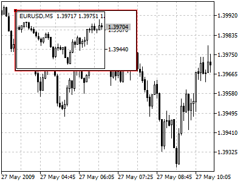
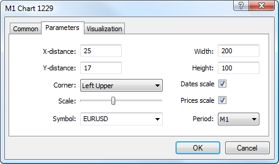

[🏠 Document Start](../../../README.md) / [Price Charts, Technical and Fundamental Analysis](../../README.md) / [Analytical Objects](../../Analytical-Objects.md) / [Graphical Objects](../Graphical-Objects.md) / Graph

[Previous](Button.md) | [Next](Bitmap.md)

# Graph

This object is used for adding a chart of any security into the chart window, which allows tracing the price dynamics of several symbols at the same time. The object is anchored to a chart window and does not move when the chart is scrolled.

> When applied, this object inherits the current properties of a chart, to which it is applied.

## Controls

The object is moved using the anchor point located on one of object sides or corners.

## Parameters

There are the following parameters of the "Chart" object:

  * X-distance — distance in pixels from the anchor corner of the chart window till the control point of the object along the time axis;
  * Y-distance — distance in pixels from the anchor corner of the chart window till the control point of the object along the price axis;
  * Width — width of the chart window;
  * Height — height of the chart window;
  * Corner — one of the corners of the chart window, from which distances along X and Y axes will be set;
  * Scale — chart scale adjusted using lever;
  * Dates scale — display or not to display the time scale in the chart;
  * Prices scale — display or not to display the price scale in the chart;
  * Symbol — selecting a symbol for the chart;
  * Period — selecting the chart period.

Common parameters of object are described in a [separate section (#draw-settings)](../../Analytical-Objects.md#draw-settings).
