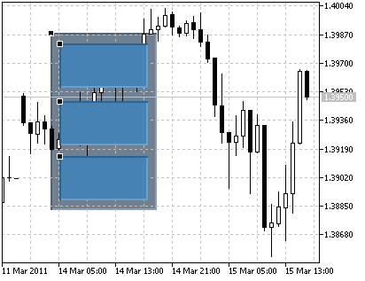
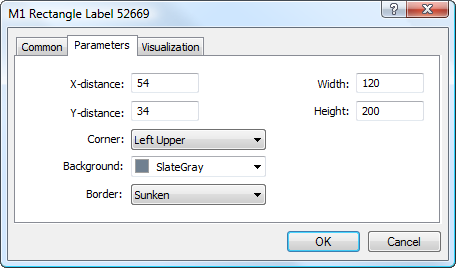

[🏠 Document Start](../../../README.md) / [Price Charts, Technical and Fundamental Analysis](../../README.md) / [Analytical Objects](../../Analytical-Objects.md) / [Graphical Objects](../Graphical-Objects.md) / Rectangle Label

[Previous](Event.md) | [Next](../../Fundamental-Analysis.md)

# Rectangle Label

This object is intended for creation of custom graphic interfaces. It can have different states that can be processed by an [MQL5 program (#mql5)](../../../Algorithmic-Trading-Trading-Robots/How-to-Create-an-Expert-Advisor-or-an-Indicator.md#mql5). For example, a program can execute an operation as a reaction to user interaction with this object.

## Controls

An object can be moved using an anchor point located in its upper left corner.

## Parameters

There are the following parameters of the object:

  * X-distance — distance in pixels from the anchor corner of the chart window till the control point of the object along the time axis;
  * Y-distance — distance in pixels from the anchor corner of the chart window till the control point of the object along the price axis;
  * Width — width of the object in pixels;
  * Height — height of the object in pixels;
  * Corner — one of the corners of the chart window, from which distances along X and Y axes will be set;
  * Background — the object fill color;
  * Border — select the type of the object Border: Flat, Raised, Sunken. 

