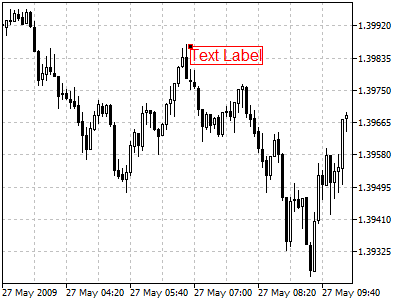
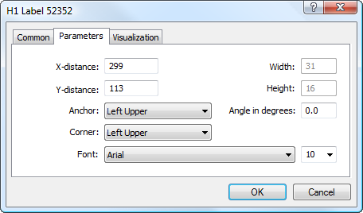

[🏠 Document Start](../../../README.md) / [Price Charts, Technical and Fundamental Analysis](../../README.md) / [Analytical Objects](../../Analytical-Objects.md) / [Graphical Objects](../Graphical-Objects.md) / Text Label

[Previous](Text.md) | [Next](Button.md)

# Text Label

This object is intended for adding text labels to a chart. The object is anchored to a chart window and does not move when the chart is scrolled. To place the object in a chart, one should select it and define the necessary point in a chart.

## Controls

The object is moved using the anchor point located on one of object sides or corners. The text content is changed via the object settings in the "Description" field of the ["Common" (#common)](../../Analytical-Objects.md#common) tab.

## Parameters

There are the following parameters of the object:

  * X-distance — distance in pixels from the anchor corner of the chart window till the control point of the object along the time axis;
  * Y-distance — distance in pixels from the anchor corner of the chart window till the control point of the object along the price axis;
  * Anchor — one of object sides or corners, where the anchor point is located;
  * Corner — one of the corners of the chart window, from which distances along X and Y axes will be set;
  * Font — font type and size for the object text;
  * Width — width of the object in pixels. This is an informational field, it cannot be modified;
  * Height — height of the object in pixels. This is an informational field, it cannot be modified;
  * Angle in degrees — angle of the object slope from the horizontal line drawn through its anchor point.

Common parameters of object are described in a [separate section (#draw-settings)](../../Analytical-Objects.md#draw-settings).
