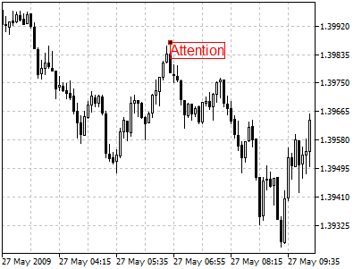
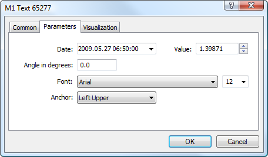

[🏠 Document Start](../../../README.md) / [Price Charts, Technical and Fundamental Analysis](../../README.md) / [Analytical Objects](../../Analytical-Objects.md) / [Graphical Objects](../Graphical-Objects.md) / Text

[Previous](../Graphical-Objects.md) | [Next](Text-Label.md)

# Text

This object is intended for adding text labels to a chart. The object is bound to a chart and moves together with it. To place the object in a chart, one should select it and define the necessary point in a chart.

## Controls

The object is moved using the anchor point located on one of object sides or corners. The text content is changed via the object settings in the "Description" field of the ["Common" (#common)](../../Analytical-Objects.md#common) tab.

## Parameters

There are the following parameters of the object:

  * Date/Value — coordinates of the anchor point of the object (date/value of the price scale);
  * Angle in degrees — angle of the object slope from the horizontal line drawn through its anchor point;
  * Font — font type and size for the object text;
  * Anchor — one of object sides or corners, where the anchor point is located.

Common parameters of object are described in a [separate section (#draw-settings)](../../Analytical-Objects.md#draw-settings).
