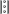
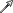

[🏠 Document Start](../../README.md) / [Price Charts, Technical and Fundamental Analysis](../README.md) / [Analytical Objects](../Analytical-Objects.md) / Lines

[Previous](../Analytical-Objects.md) | [Next](Lines/Horizontal-Line.md)

# Lines

Various lines can be applied to a price or indicator chart using the "Objects — Lines" items of the ["Insert"](../../Getting-Started/User-Interface.md) menu or the ["Line Studies"](../../Getting-Started/User-Interface.md) toolbar. The following line types are available in the platform:

| Type | Description  
 | Horizontal Line | Horizontal line can be used to mark various levels, particularly, those of support/resistance. One point must be set for this object to be imposed. [Read more...](Lines/Horizontal-Line.md)  
 | Vertical Line | Vertical line can be used to mark various borders in the time axis and to compare signals of indicators to price changes. One point must be set for this object to be imposed. [Read more...](Lines/Vertical-Line.md)  
 | Trendline | Trendline helps to explore trends in price changes. Two points must be set through which a trendline will be drawn. [Read more...](Lines/Trendline.md)  
 | Trendline by Angle | Trendline by angle helps to explore trends in price changes. Unlike for a simple trendline, an angle must be set for this line to be drawn. Two points must be set through which a trendline will be drawn. [Read more...](Lines/Trendline-by-Angle.md)  
 | Cycle Lines | This tool represents a row of vertical lines placed at equal intervals. Normally, a unit interval corresponds with one cycle. At that, completed lines are considered to describe future cycles. The tool is drawn on two points that define the unit interval. [Read more...](Lines/Cycle.md)  
 | Arrowed Line | This object is a straight line with an arrow at its end. It is intended for drawing explanatory schemes in charts. Two points must be set for this tool to be drawn. [Read more...](Lines/Arrowed-Line.md)
