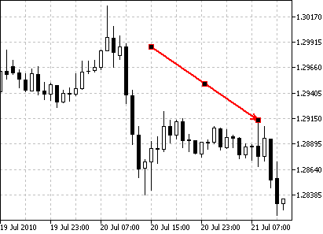
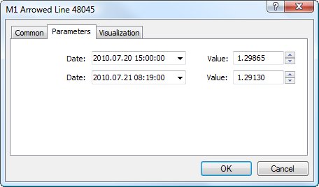

[🏠 Document Start](../../../README.md) / [Price Charts, Technical and Fundamental Analysis](../../README.md) / [Analytical Objects](../../Analytical-Objects.md) / [Lines](../Lines.md) / Arrowed Line

[Previous](Cycle.md) | [Next](../Channels.md)

# Arrowed Line

This object is a straight line with an arrow at its end. It is intended for drawing explanatory schemes in charts.

## Drawing

To draw an arrowed line, one should select this object and then click with the left mouse button in the chart. After that holding the mouse button one should draw a line in the necessary direction. Additional parameters will be shown near the end point: distance from the initial point along the time axis, distance from the initial point along the price axis, slope line from the horizontal line drawn through the initial point.

## Controls

Three points are located on an arrowed line. Extreme points are points for changing size and slope. The central one is used for moving the object.

## Parameters

There are the following parameters of an arrowed line:

  * Date/Value — coordinates of the initial point (date/value of the price scale);
  * Date/Value — coordinates of the end point (date/value of the price scale).

Common parameters of object are described in a [separate section (#draw-settings)](../../Analytical-Objects.md#draw-settings).
