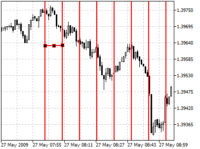
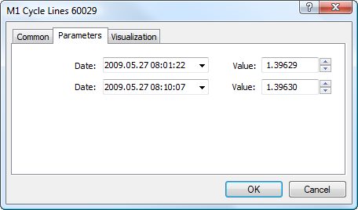

[🏠 Document Start](../../../README.md) / [Price Charts, Technical and Fundamental Analysis](../../README.md) / [Analytical Objects](../../Analytical-Objects.md) / [Lines](../Lines.md) / Cycle

[Previous](Trendline-by-Angle.md) | [Next](Arrowed-Line.md)

# Cycle Lines

To draw cycle lines, one should select this object and then click with the left mouse button in the chart to choose the initial point of the lines. After that holding the mouse button one should move the mouse to the right for setting the period to draw lines. There is a trendline between the first and second vertical lines; it helps to draw grounded cycles upon price variations.

## Parameters

There are the following parameters of cycle lines:

  * Date/Value — coordinates of the initial point (date/value of the price scale) on the first line;
  * Date/Value — coordinates of the second point (date/value of the price scale) on the second line.

Common parameters of object are described in a [separate section (#draw-settings)](../../Analytical-Objects.md#draw-settings).
