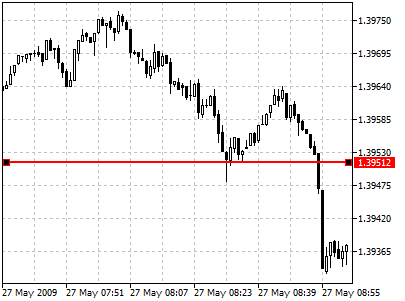
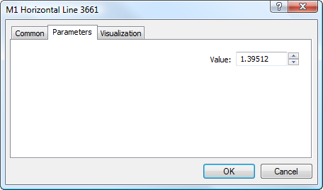

[🏠 Document Start](../../../README.md) / [Price Charts, Technical and Fundamental Analysis](../../README.md) / [Analytical Objects](../../Analytical-Objects.md) / [Lines](../Lines.md) / Horizontal Line

[Previous](../Lines.md) | [Next](Vertical-Line.md)

# Horizontal Line

To plot a horizontal line, one should select this object and click once with your left mouse-button on a necessary point in the chart.

## Parameters

A horizontal line has only one parameter - value on the price scale:

The necessary price level can be specified in the "Value" field. Common parameters of object are described in a [separate section (#draw-settings)](../../Analytical-Objects.md#draw-settings).
