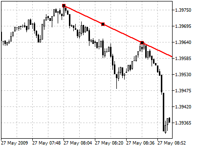
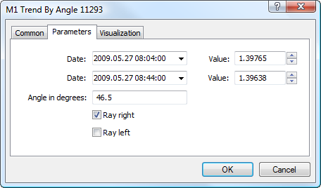

[🏠 Document Start](../../../README.md) / [Price Charts, Technical and Fundamental Analysis](../../README.md) / [Analytical Objects](../../Analytical-Objects.md) / [Lines](../Lines.md) / Trendline by Angle

[Previous](Trendline.md) | [Next](Cycle.md)

# Trendline by Angle

To draw a trendline by angle, one should select this object and then click with the left mouse button in the chart to choose the initial point of the line. After that holding the mouse button one should draw a line in the necessary direction. Additional parameters will be shown near the end point: distance from the initial point along the time axis, distance from the initial point along the price axis, slope line from the horizontal line drawn through the initial point.

## Parameters

There are the following parameters of a trendline by angle:

  * Date/Value — coordinates of the initial point (date/value of the price scale);
  * Date/Value — coordinates of the end point (date/value of the price scale);
  * Angle in degrees — slope angle of the trendline from a horizontal line drawn through the initial point;
  * Ray Right — infinite duration of a trendline to the right;
  * Ray Left — infinite duration of a trendline to the left.

Common parameters of object are described in a [separate section (#draw-settings)](../../Analytical-Objects.md#draw-settings).
