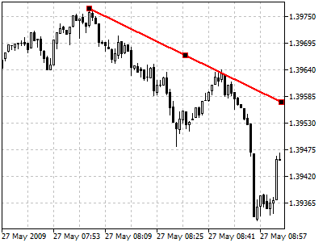
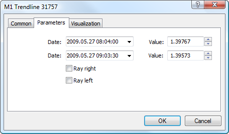

[🏠 Document Start](../../../README.md) / [Price Charts, Technical and Fundamental Analysis](../../README.md) / [Analytical Objects](../../Analytical-Objects.md) / [Lines](../Lines.md) / Trendline

[Previous](Vertical-Line.md) | [Next](Trendline-by-Angle.md)

# Trendline

A trendline is a straight line that joins two important minimal or maximal price lines in a chart. Within a main trend there can be any number of secondary or minor trends. The length of each of them differs within wide ranges. It should be remembered that a trendline must not intersect with other prices between the two selected points. A trendline is a support/resistance pass-through where price changes within the range of the pass-through.

## Drawing

To draw a trendline, one should select this object and then click with the left mouse button in the chart. After that holding the mouse button one should draw a line in the necessary direction. Additional parameters will be shown near the end point:

  * Distance from the initial point along the time axis.
  * Distance from the initial point along the price axis.
  * Slope line from the horizontal line drawn through the initial point. The slope is calculated for the chart scale of 1:1 — when one change on the time scale (bar) corresponds to one change on the price scale (point).

## Controls

Three points are located on a trendline. Extreme points are points for changing size and slope. The central one is used for moving the object.

## Parameters

There are the following parameters of a trendline:

  * Date/Value — coordinates of the initial point (date/value of the price scale);
  * Date/Value — coordinates of the end point (date/value of the price scale);
  * Ray Right — infinite duration of a trendline to the right;
  * Ray Left — infinite duration of a trendline to the left.

Common parameters of object are described in a [separate section (#draw-settings)](../../Analytical-Objects.md#draw-settings).
