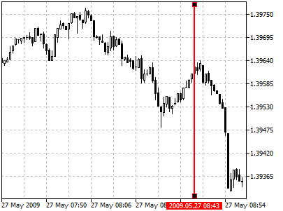
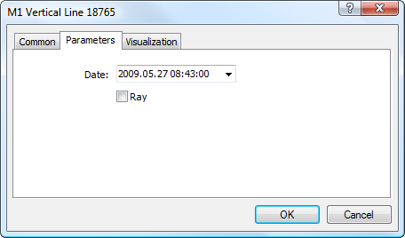

[🏠 Document Start](../../../README.md) / [Price Charts, Technical and Fundamental Analysis](../../README.md) / [Analytical Objects](../../Analytical-Objects.md) / [Lines](../Lines.md) / Vertical Line

[Previous](Horizontal-Line.md) | [Next](Trendline.md)

# Vertical Line

To plot a vertical line, one should select this object and click once with your left mouse-button on a necessary point in the chart. A separate vertical line can be displayed on each window (chart and indicator subwindows) or one vertical line can be drawn for all the windows, depending on the specified parameters.

## Parameters

There are the following parameters of a vertical line:

  * Date — position of the vertical line along the time axis;
  * Ray — if this option is enabled, one vertical line will be drawn for the chart window and [indicator](../../Technical-Indicators.md) subwindows. If the option is disabled, the vertical line will be displayed only in the window it is created in.

Common parameters of object are described in a [separate section (#draw-settings)](../../Analytical-Objects.md#draw-settings).
