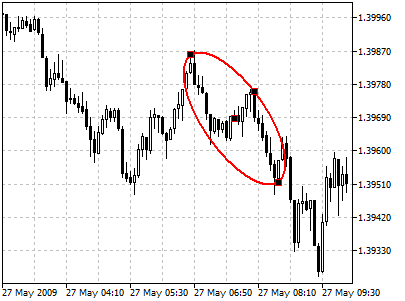
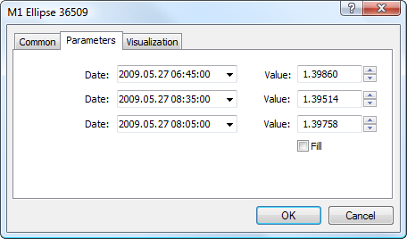

[🏠 Document Start](../../../README.md) / [Price Charts, Technical and Fundamental Analysis](../../README.md) / [Analytical Objects](../../Analytical-Objects.md) / [Shapes](../Shapes.md) / Ellipse

[Previous](Triangle.md) | [Next](../Arrows.md)

# Ellipse

To draw an ellipse, one should select the object and define an initial point in a chart. After that one should define the second point and holding the mouse drag the ellipse till the necessary size and shape.

## Controls

This object has four control points that can be moved with the mouse. Points located on faces are used for changing the size and shape of the ellipse. The point located in the center is used for moving the object without changing its shape.

## Parameters

There are the following parameters of an ellipse:

  * Date/Value — coordinates of the first point of the ellipse (date/value of the price scale);
  * Date/Value — coordinates of the second point of the ellipse (date/value of the price scale);
  * Date/Value — coordinates of the third point of the ellipse (date/value of the price scale);
  * Fill — enable/disable color filling inside the shape.

Common parameters of object are described in a [separate section (#draw-settings)](../../Analytical-Objects.md#draw-settings).

> To fill the object with the color of its lines, you should enable option the "Draw object as background" at the ["Common" (#common)](../../Analytical-Objects.md#common) tab.
