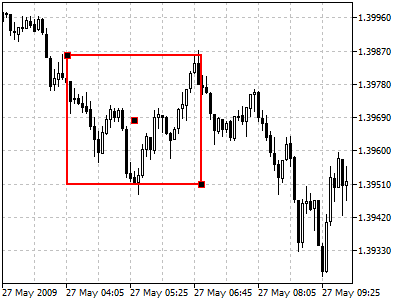
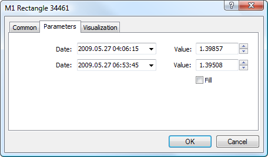

[🏠 Document Start](../../../README.md) / [Price Charts, Technical and Fundamental Analysis](../../README.md) / [Analytical Objects](../../Analytical-Objects.md) / [Shapes](../Shapes.md) / Rectangle

[Previous](../Shapes.md) | [Next](Triangle.md)

# Rectangle

To draw a rectangle, one should select the object and define an initial point in a chart. After that, holding a mouse one should drag a rectangle till the necessary size. Additional parameters will be shown near the end point: distance from the initial point along the time axis and distance from the initial point along the price axis.

## Controls

This object has three control points that can be moved by a mouse. Points located on faces are used for changing the size of the rectangle. The point located in the center is used for moving the object without changing its shape.

## Parameters

There are the following parameters of a rectangle:

  * Date/Value — coordinates of the first point of the rectangle (date/value of the price scale);
  * Date/Value — coordinates of the second point of the rectangle (date/value of the price scale);
  * Fill — enable/disable color filling inside the shape.

Common parameters of object are described in a [separate section (#draw-settings)](../../Analytical-Objects.md#draw-settings).

> To fill the object with the color of its lines, you should enable option the "Draw object as background" at the ["Common" (#common)](../../Analytical-Objects.md#common) tab.
