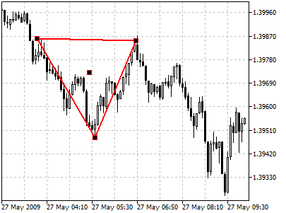
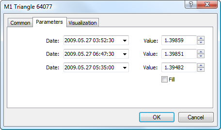

[🏠 Document Start](../../../README.md) / [Price Charts, Technical and Fundamental Analysis](../../README.md) / [Analytical Objects](../../Analytical-Objects.md) / [Shapes](../Shapes.md) / Triangle

[Previous](Rectangle.md) | [Next](Ellipse.md)

# Triangle

To draw a triangle, one should select the object and define an initial point in a chart. After that one should define the second point and holding a mouse drag a triangle till the necessary size and shape. Additional parameters will be shown near the cursor in the form of three pairs of numbers, one of which will remain unchanged. The two other pairs will show the distance from two other points along the time axis and along the price axis.

## Controls

This object has four control points that can be moved with the mouse. Points located on faces are used for changing the size and shape of the triangle. The point located in the center is used for moving the object without changing its shape.

## Parameters

There are the following parameters of a triangle:

  * Date/Value — coordinates of the first point of the triangle (date/value of the price scale);
  * Date/Value — coordinates of the second point of the triangle (date/value of the price scale);
  * Date/Value — coordinates of the third point of the triangle (date/value of the price scale);
  * Fill — enable/disable color filling inside the shape.

Common parameters of object are described in a [separate section (#draw-settings)](../../Analytical-Objects.md#draw-settings).

> To fill the object with the color of its lines, you should enable option the "Draw object as background" at the ["Common" (#common)](../../Analytical-Objects.md#common) tab.
