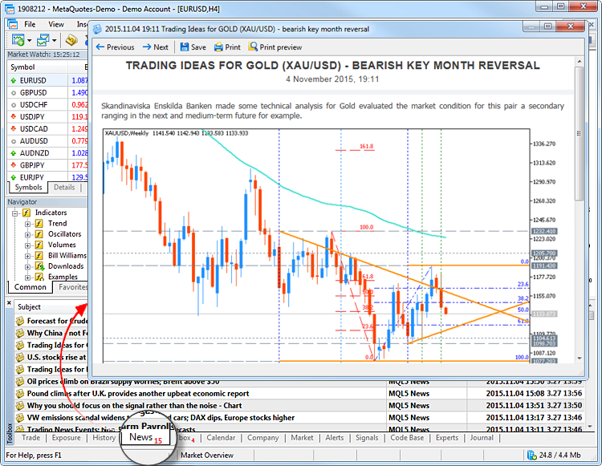
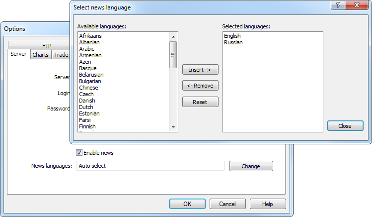
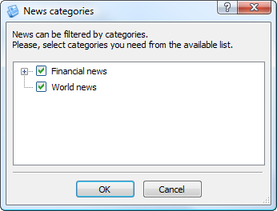
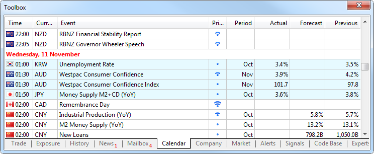
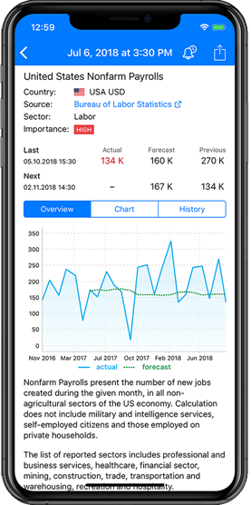
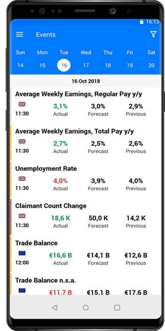
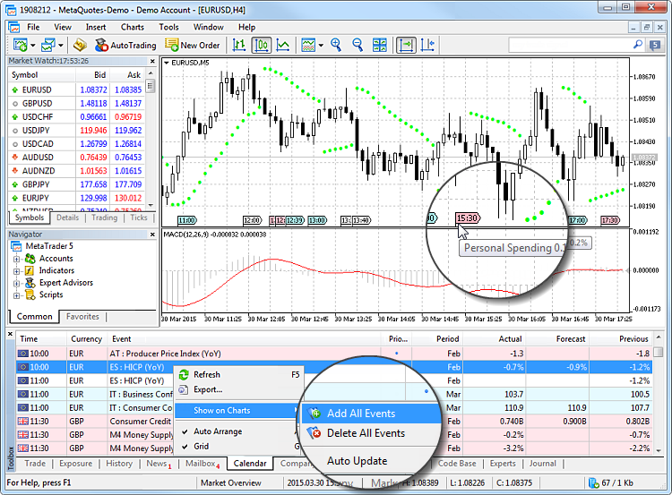

[🏠 Document Start](../README.md) / [Price Charts, Technical and Fundamental Analysis](README.md) / Fundamental Analysis

[Previous](Analytical-Objects/Graphical-Objects/Rectangle-Label.md) | [Next](Fundamental-Analysis/USA.md)

# Fundamental Analysis (#fundamental-analysis)

The purpose of fundamental analysis is in the constant monitoring and studying of various economic and industrial indicators, which may affect the quotes of a financial instrument.

For example, annual report releases, news about a new contract or a regulatory law can seriously affect the price of company shares. To keep abreast, you need to constantly analyze this information.

## Where can I read the financial news (#news)

Straight in the platform you can receive financial news from international news agencies. This helps you stay updated and take appropriate trading decisions.

News items appear on the News tab of Toolbox window. To read the news, double click on its title.

## Why do brokers provide different news? (#broker)

Any financial newsletters can be received in the trading platform. Every broker selects the news types and providers.

## How to configure the news language? (#lang-category)

Newsletters in various languages can be received in the trading platform. To configure the list of languages, open the [platform settings (#server)](../Getting-Started/Platform-Settings.md#server) by clicking " Options" in the [Tools](../Getting-Started/User-Interface.md) menu.

Click "Edit" in the "News Language" field and select the desired languages. The default is automatic selection, i.e. newsletters are filtered by the platform interface language. If you do not want to receive newsletters, uncheck "Enable news".

For your convenience, the newsletters are divided into categories. Open the context menu in the news tab. Click "Customize" in the submenu of news categories to open their setup window:

In the tree-like list, select the news categories you want to display in the trading platform.

> The types of available categories are defined by the data provider chosen by your broker.

## How to follow macroeconomic indicators? (#macro)

In addition to the news, the platform contains the [Economic Calendar](https://www.mql5.com/en/economic-calendar). The calendar features publications of over 600 [macroeconomic indicators](Fundamental-Analysis.md) concerning 15 largest global economies, including USA, European Union, Japan, UK, Canada, Australia, China, etc. Relevant data is collected from open sources in real time. 

Macroeconomic indicators are parameters describing the state of the country they are calculated for. They characterize the level of economic development and may indicate either economic growth or a decline. By analyzing the macroeconomic indicators, it is possible to forecast future price movements.

The indicators and events can be viewed on the "Calendar" tab of the "Toolbox" window.

By default, the calendar displays current week events, including past and upcoming events. Use the context menu to switch to another period. You can access events for the previous, current and next week, as well as appropriate months. A deeper history is available in the [web version](https://www.mql5.com/en/economic-calendar).

Every indicator is provided with the release time, priority, as well as its current, forecast and previous values. The current value appears as soon as the indicator is released. If this value is less than the predicted one, the indicator is highlighted in red. If the current value is larger, the indicator is shown in blue.

To view a detailed event description or the history of its values as a graph or table, double click on its name.

For easier search, filter events in the list using the context menu:

  * by priority
  * by the currency of the country for which the indicator is published
  * by country for which the indicator is published

### Install the Calendar on your site (#install-the-calendar-on-your-site)

| 

### Download the mobile calendar version (#download-the-mobile-calendar-version)
  
---|---  
You can add the Economic Calendar in your site free of charge. This can be done by pasting [the ready widget code](https://www.mql5.com/en/economic-calendar/widgets) in the desired web page. You do not have to worry about licensing risks. The Calendar is based on data collected from public sources. The advantages of the Calendar:

  * Useful content on your site: offer your visitors a powerful service for tracking global economic events.
  * Flexible customization for your website: set the desired widget width and height, the amount of data displayed, the language and date format.
  * Multilingual interface: all events and descriptions are fully translated into 9 languages, including English, Chinese, Japanese, Russian, Spanish, Portuguese, German, Turkish and Arabic.
  * Full representation: every event is provided with a detailed description and notes related to the release influence on individual currencies, as well as the source link, release date and charts.
  * No ads: you will not have to pay for the service by showing third-party ads.
  * Automatic time zone selection: event tracking is maintained via local time adaptation. Manual adaptation of time zones is also possible.
  * Automatic update: the calendar is automatically updated as soon as a new event appears in a source.
  * Continuous development: when a country is added, all economic indices which have a significant impact on the national currency are included in the calendar.

[Install the Calendar in your site >>](https://www.mql5.com/en/economic-calendar/widgets?utm_campaign=metatrader5.help) | The Economic Calendar is available as a separate [Tradays](https://www.tradays.com) application for mobile devices powered by iOS and Android. The mobile version features a complete set of functions for the full-fledged operation and a number of additional features:

  * More than 600 events related to the world's largest economies, including US, UK, European Union, japan, Canada, Australia, China, among others.
  * Detailed event descriptions.
  * Access to historic indicator values in the form of tables and charts.
  * Filters by priority and countries, to which the indicators are related.
  * Ability to create event reminders in a couple of clicks.

|   |    
---|---  
  

## Types of Macroeconomic Indicators (#macro-type)

Macroeconomic indicators are categorized based on the countries for which they are published. Read the detailed description of the most popular indicators in further topics:

  * [US macroeconomic indicators](Fundamental-Analysis/USA.md)
  * [EU macroeconomic indicators](Fundamental-Analysis/European-Union.md)
  * [UK macroeconomic indicators](Fundamental-Analysis/United-Kingdom.md)
  * [Macroeconomic indicators of Japan](Fundamental-Analysis/Japan.md)
  * [Macroeconomic indicators of Germany](Fundamental-Analysis/Germany.md)
  * [Macroeconomic indicators of Switzerland](Fundamental-Analysis/Switzerland.md)
  * [Macroeconomic indicators of Australia](Fundamental-Analysis/Australia.md)
  * [Macroeconomic indicators of Canada](Fundamental-Analysis/Canada.md)
  * [Macroeconomic indicators of China](Fundamental-Analysis/China.md)
  * [Macroeconomic indicators of New Zealand](Fundamental-Analysis/New-Zealand.md)

## How to display the macroeconomic indicators on a chart? (#chart)

Information about macroeconomic events can be displayed on the charts of corresponds currency pairs. You can visually assess the impact of various events on the currencies.

To add the indicators to the chart, click on " Add All Events" in the context menu of the calendar.
