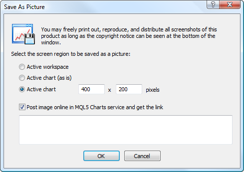
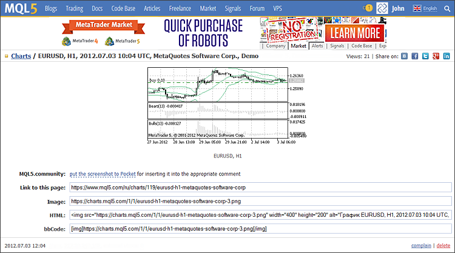
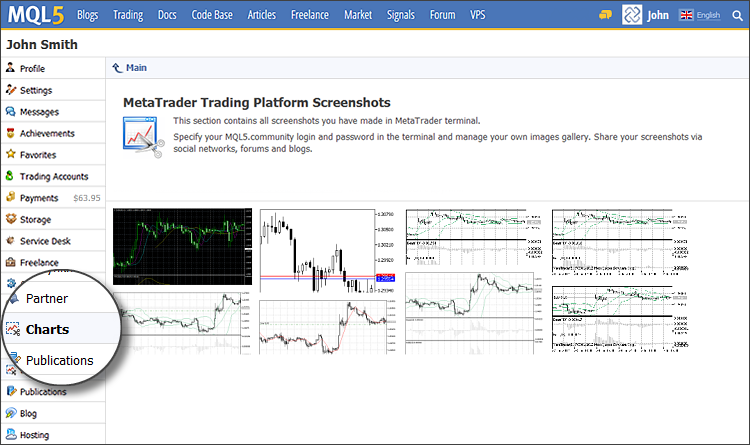

[🏠 Document Start](../README.md) / [Price Charts, Technical and Fundamental Analysis](README.md) / Publish Online

[Previous](View-and-Configure-Charts.md) | [Next](Technical-Indicators.md)

# Publishing Charts Online (#publishing-charts-online)

The trading platform is tightly integrated with the [MQL5.community](../MQL5-Algotrading-community/README.md) website to provide access to its powerful services. One of these services is the MQL5 Charts. It allows to publish screenshots of the trading platform online. In just a few clicks you can publish a screenshot, receive a link to share it with your fellow traders or post it in one of the popular social networks (Facebook, Twitter, Google+, etc.)

MQL5.community account is not required for publishing screenshots. If your account is not specified in the platform settings, a screenshot will be published anonymously and you will receive a link.

However, publication with reference to an MQL5.community account provides a number of obvious advantages: you can create your own gallery of images and manage it via the "Charts" tab of your MQL5.community profile.

## How to Make a Screenshot Using Trading Platform Tools (#screenshot)

To take a screenshot of a chart, click " Save As Picture" in its [context menu (#save-as-picture)](Additional-Features/Chart-Management.md#save-as-picture).

The following options are available:

  * Active workspace — save the entire window of the trading platform.
  * Active chart (as is) — save the active chart with its current size.
  * Active chart — save the active chart with the specified size (in pixels).
  * Post image online in MQL5 Charts service and get the link — if this option is disabled, the chart is saved on a user's PC. A click on OK opens the standard file saving window. If this option is enabled, the chart is saved online in the MQL5 Charts service. In the empty field below you can add a comment for the chart you want to publish.

## Publishing Charts Online in the MQL5 Charts (#publish)

To post a screenshot of the trading platform online, enable "Post image online in MQL5 Charts service and get the link" option. Text comments can be added to the published image. A new browser window with the published image is opened upon clicking "OK":

The following data is added at the top of the chart display window:

  * Automatically generated header — current chart symbol and period, date of publication and trade server name.
  * Views — number of screenshot views.
  * Commands for publishing screenshots in social networks — VK, Facebook, Twitter, Google+, Evernote, Pinterest, LinkedIn, LiveJournal. Clicking one of these buttons opens the appropriate web resource. If you are already authorized in a social network, a screenshot is published immediately via your profile.

Next the screenshot is displayed. The comment text is shown below. If a comment is not added during the publication, an automatically generated caption containing the current chart symbol and period is added.

Various links to the screenshot are displayed at the bottom:

  * Link to this page — a link to the screenshot view page.
  * Image — a direct link to the image.
  * HTML — a link for insertion in HTML page source code.
  * bbCode — a link for insertion in an editor supporting bbCode markup language (used by many web resources, forums, etc.)

The screenshot creation date is displayed at the bottom of the window. When you point the mouse cursor to the line, the delete button appears. You can use it to remove a published screenshot.

## Screenshot Gallery in the MQL5.community Profile (#gallery)

If a user has specified MQL5.community account in the [platform settings (#community)](../Getting-Started/Platform-Settings.md#community), a published screenshot is bound to this account. Every MQL5.community profile has the "Charts" section, where all the user's posted images are stored:

Click on the image thumbnail to [view (#publish)](Publish-Online.md#publish) it. In the "Charts" tab, you can easily manage your image gallery and share screenshots with other community members and friends in social networks.

> MQL5.community account is not required for publishing screenshots. If your account information is not specified, the screenshots are published anonymously.
