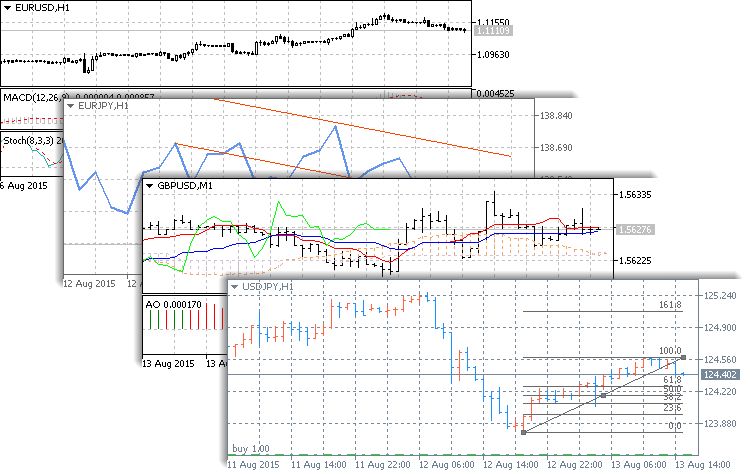
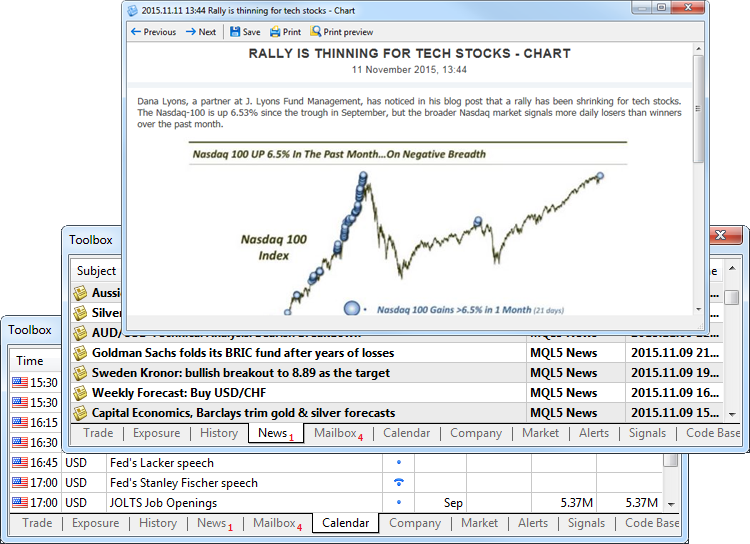

[🏠 Document Start](../README.md) / Price Charts, Technical and Fundamental Analysis

[Previous](../Trading-Operations/For-Advanced-Users/Trading-Report.md) | [Next](View-and-Configure-Charts.md)

# Price Charts, Technical and Fundamental Analysis

The most important aspect in financial market trading is making correct decisions about market entries and exits. When to trade and when to wait for more favorable conditions? The analytical tools available in the trading platform will help answer this question.

There are countless methods of market analysis and trading strategies based on the analytical tools. All of them can be divided into two broad categories: technical and fundamental analysis.

## Price Charts and Technical Analysis

The essence of technical analysis is studying price [charts](Additional-Features/Chart-Settings.md) of financial instruments using technical indicators and analytical objects. Charts in the platform have a variety of settings, so that traders can customize them and adapt to their personal needs. Every chart can display 21 timeframes from one minute (M1) to one month (MN1).

Customize charts: enable bars, candlesticks or the broken line, change colors or elements.

Every chart can display 21 timeframes.

Open up to 100 charts simultaneously.

Use 38 built-in technical indicators and an unlimited number of custom indicators available in the [Market](../Market-App-Store/README.md) and [Code Base](Additional-Technical-Indicators.md).

44 analytical objects are available in the platform, including Fibonacci and Gann objects, channels, and much more.

The trading platform provides various analytical tools for price analysis: [38 technical indicators](Technical-Indicators.md) and [44 graphical objects](Analytical-Objects.md). Moreover, in addition to the built-in analysis tools you can download source codes of various free applications from the [Code Base](Additional-Technical-Indicators.md). Thousands of ready-to use applications for technical analysis and automated trading are also available on the [Market](../Market-App-Store/README.md).

## Fundamental Analysis

The meaning of fundamental analysis is in the constant monitoring and studying of various economic and industrial indicators, which may affect the quotes of a financial instrument.

For example, annual report releases, news about a new contract or a regulatory law can seriously affect the price of company shares. To keep abreast, you need to constantly analyze this information.

Straight in the platform you can receive financial news from international news agencies. This helps you stay updated and take appropriate trading decisions.

Read financial news from international news agencies straight in the trading platform. This helps you stay updated and take appropriate trading decisions.

Analyze macroeconomic events using the Economic Calendar. Evaluate the economic development to forecast price movements.

In addition to the news, the platform contains the Economic Calendar. It provides publications of [macroeconomic indicators](Fundamental-Analysis.md) — some parameters describing the state of the country they are calculated for. They characterize the level of economic development and indicate either economic growth or decline. They are used for forecasting price trends.
