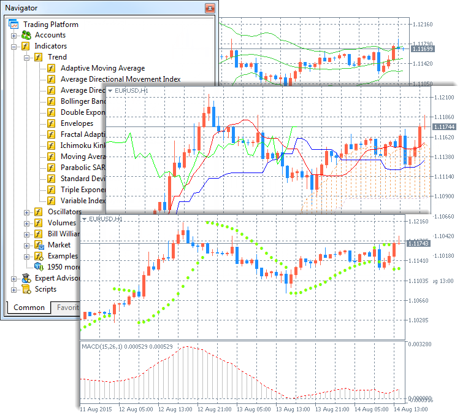
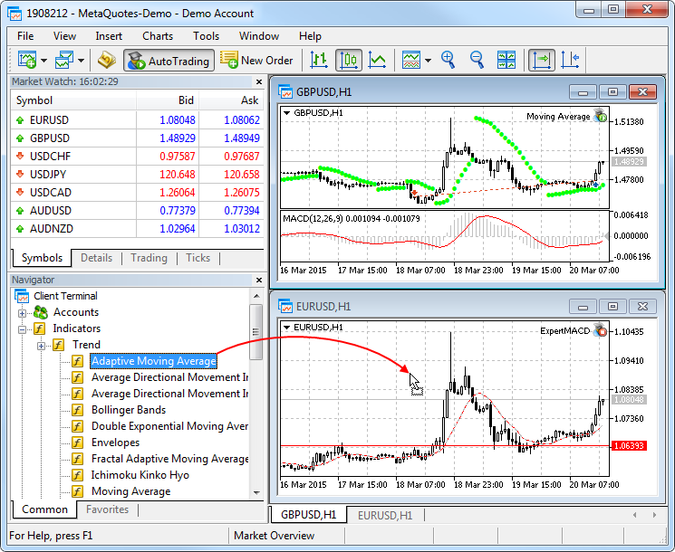
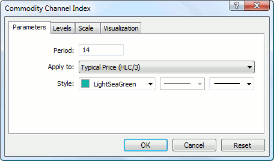
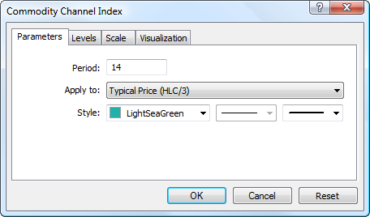
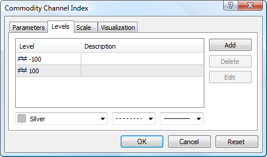

[🏠 Document Start](../README.md) / [Price Charts, Technical and Fundamental Analysis](README.md) / Technical Indicators

[Previous](Publish-Online.md) | [Next](Technical-Indicators/Trend-Indicators.md)

# Technical Indicators (#technical-indicators)

An indicator is the most important tool for technical analysis. Decisions about how and when to trade can be made on the basis of technical indicator signals. The essence of technical indicators is a mathematical transformation of a financial symbol price aimed at forecasting future price changes. This provides an opportunity to identify various characteristics and patterns in price dynamics which are invisible to the naked eye.

## Types of Indicators (#type)

In accordance with the functional properties, indicators can be divided into two types: [trend indicators](Technical-Indicators/Trend-Indicators.md) and [oscillators](Technical-Indicators/Oscillators.md). Trend indicators help to identify the price direction and find trend reversal moments synchronously or with a delay. Oscillators allow to define market reversal points in advance or simultaneously.

A separate category includes indicators calculated based on [volumes](Technical-Indicators/Volume-Indicators.md). For the Forex market, 'volume' means the number of ticks (price changes) within a time interval. For stock securities volume means the volume of executed trades (in contracts or money terms).

Another category is [Bill Williams' indicators](Technical-Indicators/Bill-Williams'-Indicators.md). They are included into a separate group because they are part of the trading system described in his books.

The above categories include built-in indicators of the trading platform. 38 indicators are available in the platform. A large number of custom technical indicators can also be used in the platform. You can download source codes of various free applications from the [Code Base](Additional-Technical-Indicators.md). Thousands of ready-to use applications for technical analysis and automated trading are also available on the [Market](../Market-App-Store/README.md).

For convenience, all the indicators are divided into groups in the Navigator window.

## How to Run an Indicator on the Chart (#run)

The most convenient way to apply an indicator is to drag it from the [Navigator](../Getting-Started/User-Interface.md) window. You can also use the Indicators command from the [Insert](../Getting-Started/User-Interface.md) menu or button  on the [Standard](../Getting-Started/User-Interface.md) toolbar.

A technical indicator can be drawn in a separate indicator window with its own vertical scale (for example, [MACD](Technical-Indicators/Oscillators/MACD.md)) or applied directly onto a price chart (like [Moving Average](Technical-Indicators/Trend-Indicators/Moving-Average.md)).

## How to Change Settings of an Applied Indicator (#modify)

The settings of a running indicator can be changed. Select the required indicator in the [Indicator List (#indicators)](Additional-Features/Lists-of-Objects-Applied.md#indicators) and click "Properties" or use the indicator context menu on the chart.

Use the context menu to manage indicators:

  *  Properties — open [indicator properties (#appearance)](Technical-Indicators.md#appearance);
  *  Delete Indicator — remove the selected indicator from the chart;
  *  Delete Indicator Window — delete the indicator subwindow. This command is only available in the context menu of indicators running in a separate subwindow;
  *  Indicator List — open the [Indicator List (#indicators)](Additional-Features/Lists-of-Objects-Applied.md#indicators) window.

> Moving a mouse cursor to a line, symbol or a histogram border of an indicator, you can precisely define the value of the indicator at this point.

## How to Customize the Indicator Appearance (#appearance)

You can conveniently customize the appearance of indicators in the trading platform. You can set up the indicator parameters when applying it to a chart or modify them later. The indicator appearance is adjusted on the "Properties" tab:

Indicator line color, width and style are set up in the "Style" field.

Display of various elements can be individually configured for [Ichimoku Kinko Hyo](Technical-Indicators/Trend-Indicators/Ichimoku-Kinko-Hyo.md), [Alligator](Technical-Indicators/Bill-Williams'-Indicators/Alligator.md) and [custom indicators](../Algorithmic-Trading-Trading-Robots/Expert-Advisors-and-Custom-Indicators.md). The line color, width and type can be set on the "Colors" tab.

## How to Choose Data to Draw an Indicator (#data)

Indicators can be plotted based on price data and derivatives thereof (Median Price, Typical Price, Weighted Close), as well as on the basis of other indicators. For example, you can apply [Moving Average](Technical-Indicators/Trend-Indicators/Moving-Average.md) to [Awesome Oscillator](Technical-Indicators/Bill-Williams'-Indicators/Awesome-Oscillator.md) and have an additional AO signal line. First you need to draw the AO indicator, and then apply MA to it. In the MA settings select option "Previous Indicator's Data" in the "Apply to" field. If you choose "First Indicator's Data", MA will be applied to the very first added indicator, i.e. it can be any other indicator.

Nine variants of indicator construction are available:

  * Close — based on close prices.
  * Open — based on open prices.
  * High — based on High prices.
  * Low — based on Low prices.
  * Median Price (HL/2) — based on the median price: (High + Low)/2.
  * Typical Price (HLC/3) — based on the typical price: (High + Low + Close)/3.
  * Weighted Close (HLCC/4) — based on the average weighted close price: (High + Low + 2*Close)/4.
  * First indicator's data — based on the values of the first applied indicator. The option of using the data of the first indicator is only available for indicators in a separate window, because in the main chart window the first indicator is the price.
  * Previous indicator's data — based on the values of the previous indicator.

### How to Set Up Additional Indicator Levels (#levels)

For some indicators, additional levels can be enabled. Open the "Levels" tab, click "Add" and enter the level value in the table. You can also optionally add the level description.

The line color, width and style for the levels can be set up below. To edit a level, click "Edit" or double-click on the appropriate field.

> For indicators applied to a price chart, levels are drawn by summing the indicator values and the specified level. For indicators drawn in a separate subwindow, levels are drawn as horizontal lines through the specified value on the vertical scale.

### Indicator Display Settings (#visualization)

The indicator display for different timeframes ([period (#operations)](View-and-Configure-Charts.md#operations)) can be set up on the "Visualization" tab. The indicator will only be displayed for the selected timeframes. This can be useful when the indicator is designed for use on specific timeframes.

Option "Show in the Data Window" allows to manage indicator information displayed in the [Data Window (#datawindow)](View-and-Configure-Charts.md#datawindow).

Some indicators have additional scale settings. Indicator properties window has an additional "Scale" tab:

  * Inherit Scale — enable/disable scale inheritance from the first indicator in the window. If this option is enabled, the indicator has the same scale as the one applied prior to this one;
  * Scale by Line — enable/disable fixation of a certain indicator value in its subwindow using a drag-and-drop line. If this option is enabled, "scale percent" and "scale value" fields become active; the value of the indicator to be fixed can be specified there. Once the value is set, a line is added to the indicator window, using which you can set a fixed level of indicator values on the vertical scale;
  * Fixed Minimum — enable/disable fixation of a minimum value of the vertical scale of an indicator subwindow. If enabled, the option activates the field for entering the corresponding value;
  * Fixed Maximum — enable/disable fixation of a maximum value of the vertical scale of an indicator subwindow. If enabled, the option activates the field for entering the corresponding value.

