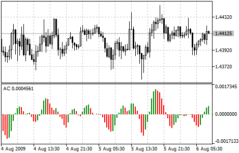

[🏠 Document Start](../../../README.md) / [Price Charts, Technical and Fundamental Analysis](../../README.md) / [Technical Indicators](../../Technical-Indicators.md) / [Bill Williams' Indicators](../Bill-Williams'-Indicators.md) / Accelerator Oscillator

[Previous](../Bill-Williams'-Indicators.md) | [Next](Alligator.md)

# Accelerator Oscillator

Price is the latest element to change. Prior to price changes, the market driving force changes its direction, the driving force acceleration must slow down and reach nought. After that it starts accelerating in the opposite direction until price starts changing its direction.

Acceleration/Deceleration Technical Indicator (AC) measures acceleration and deceleration of the current driving force. This indicator will change direction before any changes in the driving force, which, it its turn, will change its direction before the price. If you realize that Acceleration/Deceleration is a signal of an earlier warning, it gives you evident advantages.

The nought line is basically the spot where the driving force is at balance with the acceleration. If Acceleration/Deceleration is higher than nought, then it is usually easier for the acceleration to continue the upward movement (and vice versa in cases when it is below nought). Unlike in case with [Awesome Oscillator](Awesome-Oscillator.md), it is not regarded as a signal when the nought line is crossed. The only thing that needs to be done to control the market and make decisions is to watch for changes in color. To save yourself serious reflections, you must remember: you can not buy with the help of Acceleration/Deceleration, when the current column is colored red, and you can not sell, when the current column is colored green.

If you enter the market in the direction of the driving force (the indicator is higher than nought, when buying, or it is lower than nought, when selling), then you need only two green columns to buy (two red columns to sell). If the driving force is directed against the position to be opened (indicator below nought for buying, or higher than nought for selling), a confirmation is needed, hence, an additional column is required. In this case the indicator is to show three red columns over the nought line for a short position and three green columns below the nought line for a long position.

> You can test the [trade signals](https://www.mql5.com/en/docs/standardlibrary/ExpertClasses/CSignal/signal_ac) of this indicator by creating an Expert Advisor in [MQL5 Wizard](https://www.metatrader5.com/en/automated-trading/mql5wizard).

## Calculation

AC bar chart is the difference between the value of 5/34 of the driving force bar chart and 5-period simple moving average, taken from that bar chart.

MEDIAN PRICE = (HIGH + LOW) / 2

AO = SMA (MEDIAN PRICE, 5) - SMA (MEDIAN PRICE, 34)

AC = AO - SMA (AO, 5)

Where:

MEDIAN PRICE — median price;  
HIGH — the highest price of the bar;  
LOW — the lowest price of the bar;  
SMA — Simple Moving Average;  
AO — [Awesome Oscillator](Awesome-Oscillator.md).
