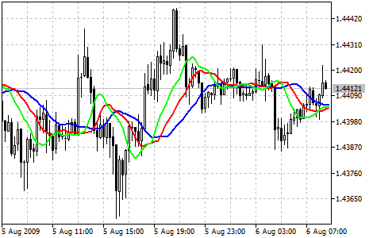

[🏠 Document Start](../../../README.md) / [Price Charts, Technical and Fundamental Analysis](../../README.md) / [Technical Indicators](../../Technical-Indicators.md) / [Bill Williams' Indicators](../Bill-Williams'-Indicators.md) / Alligator

[Previous](Accelerator-Oscillator.md) | [Next](Awesome-Oscillator.md)

# Alligator

Most of the time the market remains stationary. Only for some 15–30% of time the market generates trends, and traders who are not located in the exchange itself derive most of their profits from the trends. My Grandfather used to repeat: "Even a blind chicken will find its corns, if it is always fed at the same time". We call the trade on the trend "a blind chicken market". It took us years, but we have produced an indicator, that lets us always keep our powder dry until we reach the "blind chicken market".

Bill Williams

Alligator Technical Indicator is a combination of Balance Lines ([Moving Averages](../Trend-Indicators/Moving-Average.md)) that use fractal geometry and nonlinear dynamics.

  * The blue line (Alligator's Jaw) is the Balance Line for the timeframe that was used to build the chart (13-period [Smoothed Moving Average (#smma)](../Trend-Indicators/Moving-Average.md#smma), moved into the future by 8 bars);
  * Red Line (Alligator's Teeth) is the Balance Line for the value timeframe of one level lower (8-period [Smoothed Moving Average (#smma)](../Trend-Indicators/Moving-Average.md#smma), moved by 5 bars into the future);
  * Green Line (Alligator's Lips) is the Balance Line for the value timeframe, one more level lower (5-period [Smoothed Moving Average (#smma)](../Trend-Indicators/Moving-Average.md#smma), moved by 3 bars into the future).

Lips, Teeth and Jaw of the Alligator show the interaction of different time periods. As clear trends can be seen only 15 to 30 per cent of the time, it is essential to follow them and refrain from working on markets that fluctuate only within certain price periods.

When the Jaw, the Teeth and the Lips are closed or intertwined, it means the Alligator is going to sleep or is asleep already. As it sleeps, it gets hungrier and hungrier — the longer it will sleep, the hungrier it will wake up. The first thing it does after it wakes up is to open its mouth and yawn. Then the smell of food comes to its nostrils: flesh of a bull or flesh of a bear, and the Alligator starts to hunt it. Having eaten enough to feel quite full, the Alligator starts to lose the interest to the food/price (Balance Lines join together) — this is the time to fix the profit.

## Calculation

MEDIAN PRICE = (HIGH + LOW) / 2

ALLIGATORS JAW = SMMA (MEDIAN PRICE, 13, 8)

ALLIGATORS TEETH = SMMA (MEDIAN PRICE, 8, 5)

ALLIGATORS LIPS = SMMA (MEDIAN PRICE, 5, 3) 

Where:

MEDIAN PRICE — median price;  
HIGH — the highest price of the bar;  
LOW — the lowest price of the bar;  
SMMA (A, B, C) — [Smoothed Moving Average (#smma)](../Trend-Indicators/Moving-Average.md#smma). A parameter is for data to be smoothed, B is the smoothing period, C is shift to future. For example, SMMA (MEDIAN PRICE, 5, 3) means that the smoothed moving average will be calculated on the median price, smoothing period being equal to 5 bars and shift being 3;  
ALLIGATORS JAW — Alligator's jaws (blue line);  
ALLIGATORS TEETH — Alligator's teeth (red line);  
ALLIGATORS LIPS — Alligator's lips (green line).
