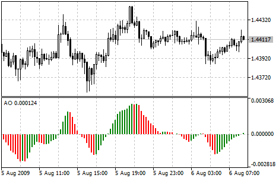

[🏠 Document Start](../../../README.md) / [Price Charts, Technical and Fundamental Analysis](../../README.md) / [Technical Indicators](../../Technical-Indicators.md) / [Bill Williams' Indicators](../Bill-Williams'-Indicators.md) / Awesome Oscillator

[Previous](Alligator.md) | [Next](Fractals.md)

# Awesome Oscillator

Bill Williams's Awesome Oscillator Technical Indicator (AO) is a 34-period simple moving average, plotted through the bars midpoints (H+L)/2, which is subtracted from the 5-period simple moving average, built across the bars midpoints (H+L)/2. It shows us quite clearly what’s happening to the market driving force at the present moment.

## Signals to Buy

"Saucer" is the only signal to buy that comes when the bar chart is higher than the zero line. One must bear in mind:

  * the saucer signal is generated when the bar chart reversed its direction from the downward to upward. The second column is lower than the first one and is colored red. The third column is higher than the second and is colored green;
  * for the saucer signal to be generated the bar chart should have at least three columns.

Keep in mind, that all Awesome Oscillator columns should be over the zero line for the saucer signal to be used.

"Zero line crossing" is the signal to buy generated when the bar chart passes from the area of negative values to that of positive. It comes when the bar chart crosses the zero line. As regards this signal:

  * for this signal to be generated, only two columns are necessary;
  * the first column is to be below the zero line, the second one is to cross it (transition from a negative value to a positive one);
  * simultaneous generation of signals to buy and to sell is impossible.

"Twin peaks" is the only signal to buy that can be generated when the bar chart values are below the zero line. As regards this signal, please, bear in mind:

  * the signal is generated, when you have a peak pointing down (the lowest minimum) which is below the zero line and is followed by another down-pointing peak which is somewhat higher (a negative figure with a lesser absolute value, which is therefore closer to the zero line), than the previous down-looking peak;
  * the bar chart is to be below the zero line between the twin peaks. If the bar chart crosses the zero line in the section between the peaks, the signal to buy doesn’t function. However, a different signal to buy will be generated — zero line crossing;
  * each new peak of the bar chart is to be higher (a negative number of a lesser absolute value that is closer to the zero line) than the previous peak;
  * if an additional higher peak is formed (that is closer to the zero line) and the bar chart has not crossed the zero line, an additional signal to buy will be generated.

## Signals to Sell

Awesome Oscillator signals to sell are identical to the signals to buy. The saucer signal is reversed and is below zero. Zero line crossing is on the decrease — the first column of it is over the zero, the second one is under it. The twin peaks signal is higher than the zero line and is reversed too.

> You can test the [trade signals](https://www.mql5.com/en/docs/standardlibrary/ExpertClasses/CSignal/signal_ao) of this indicator by creating an Expert Advisor in [MQL5 Wizard](https://www.metatrader5.com/en/automated-trading/mql5wizard).

## Calculation

AO is a 34-period simple moving average, plotted through the central points of the bars (H+L)/2, and subtracted from the 5-period simple moving average, graphed across the central points of the bars (H+L)/2.

MEDIAN PRICE = (HIGH + LOW) / 2 

AO = SMA (MEDIAN PRICE, 5) - SMA (MEDIAN PRICE, 34)

Where:

MEDIAN PRICE — median price;  
HIGH — the highest price of the bar;  
LOW — the lowest price of the bar;  
SMA — [Simple Moving Average (#sma)](../Trend-Indicators/Moving-Average.md#sma).
