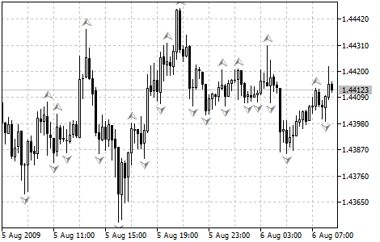

[🏠 Document Start](../../../README.md) / [Price Charts, Technical and Fundamental Analysis](../../README.md) / [Technical Indicators](../../Technical-Indicators.md) / [Bill Williams' Indicators](../Bill-Williams'-Indicators.md) / Fractals

[Previous](Awesome-Oscillator.md) | [Next](Gator-Oscillator.md)

# Fractals

All markets are characterized by the fact that on the most part the prices do not change too much, and only short periods of time (15–30 percent) account for trend changes. Most lucrative periods are usually the case when market prices change according to a certain trend.

A Fractal is one of five indicators of Bill Williams’ trading system, which allows to detect the bottom or the top. Technical definition of the upwards fractal is a series of at least five successive bars, with the highest HIGH in the middle, and two lower HIGHs on both sides. The reversing set is a series of at least five successive bars, with the lowest LOW in the middle, and two higher LOWs on both sides, which correlates to the sell fractal. The fractals have High and Low values and are indicated with the up and down arrows in a chart.

The Fractal signals need to be filtrated with the use of [Alligator](Alligator.md). In other words, you should not close a buy transaction, if the fractal is lower than the Alligator’s Teeth, and you should not close a sell transaction, if the fractal is higher than the Alligator’s Teeth. After the fractal signal has been created and is in force, which is determined by its position beyond the Alligator’s Mouth, it remains a signal until it gets attacked, or until a more recent fractal signal emerges.

