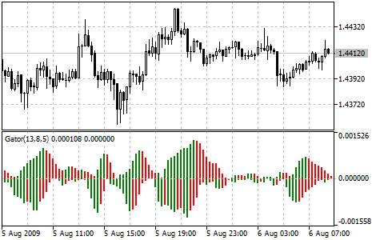

[🏠 Document Start](../../../README.md) / [Price Charts, Technical and Fundamental Analysis](../../README.md) / [Technical Indicators](../../Technical-Indicators.md) / [Bill Williams' Indicators](../Bill-Williams'-Indicators.md) / Gator Oscillator

[Previous](Fractals.md) | [Next](Market-Facilitation-Index.md)

# Gator Oscillator

Gator Oscillator is based on the [Alligator](Alligator.md) and shows the degree of convergence/divergence of the Balance Lines ([Smoothed Moving Average (#smma)](../Trend-Indicators/Moving-Average.md#smma)). The upper histogram is the absolute difference between the values of the blue and the red lines. The lower histogram is the absolute difference between the values of the red line and the green line, but with the minus sign, as the histogram chart is drawn top-down.

## Calculation

MEDIAN PRICE = (HIGH + LOW) / 2

ALLIGATORS JAW = SMMA (MEDIAN PRICE, 13, 8)

ALLIGATORS TEETH = SMMA (MEDIAN PRICE, 8, 5)

ALLIGATORS LIPS = SMMA (MEDIAN PRICE, 5, 3)

Where:

MEDIAN PRICE — median price;  
HIGH — the highest price of the bar;  
LOW — the lowest price of the bar;  
SMMA (A, B, C) — [Smoothed Moving Average (#smma)](../Trend-Indicators/Moving-Average.md#smma). Parameter A — smoothed data, B — smoothing period, C — shift to future. For example, SMMA (MEDIAN PRICE, 5, 3) means that the smoothed moving average is taken from the median price, while the smoothing period is equal to 5 bars, and the shift is equal to 3 bars;  
ALLIGATORS JAW — Alligator's jaws (blue line);  
ALLIGATORS TEETH — Alligator's teeth (red line);  
ALLIGATORS LIPS — Alligator's lips (green line).
