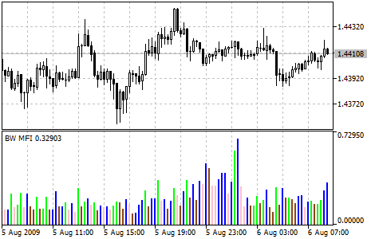

[🏠 Document Start](../../../README.md) / [Price Charts, Technical and Fundamental Analysis](../../README.md) / [Technical Indicators](../../Technical-Indicators.md) / [Bill Williams' Indicators](../Bill-Williams'-Indicators.md) / Market Facilitation Index

[Previous](Gator-Oscillator.md) | [Next](../../Analytical-Objects.md)

# Market Facilitation Index

Market Facilitation Index Technical Indicator (BW MFI) is the indicator which shows the change of price for one tick. Absolute values of the indicator do not mean anything as they are, only indicator changes have sense. Bill Williams emphasizes the interchanging of MFI and volume:

  * Market Facilitation Index increases and volume increases — this points out that: a) the number of players coming into the market increases (volume increases) b) the new coming players open positions in the direction of bar development, i.e., the movement has begun and picks up speed.
  * Market Facilitation Index falls and volume falls. It means the market participants are not interested anymore.
  * Market Facilitation Index increases, but the volume falls. It is most likely, that the market is not supported with the volume from traders, and the price is changing due to speculations of the floor traders (broker agents and dealers).
  * Market Facilitation Index falls, but the volume increases. There is a battle between bulls and bears, characterized by a large sell and buy volume, but the price is not changing significantly since the forces are equal. One of the contending parties (buyers vs. sellers) will eventually win the battle. Usually, the break of such a bar lets you know if this bar determines the continuation of the trend or annuls the trend. Bill Williams calls such bar "curtsying".

## Calculation

To calculate Market Facilitation Index you need to subtract the lowest bar price from the highest bar price and divide it by the volume.

BW MFI = (HIGH - LOW) / VOLUME

Where:

HIGH — the highest price of the bar;  
LOW — the lowest price of the bar;  
VOLUME — volume of the current bar.
