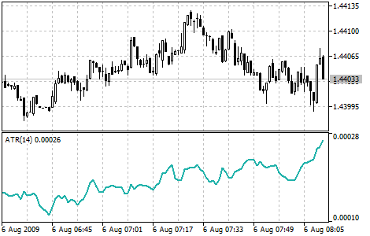

[🏠 Document Start](../../../README.md) / [Price Charts, Technical and Fundamental Analysis](../../README.md) / [Technical Indicators](../../Technical-Indicators.md) / [Oscillators](../Oscillators.md) / Average True Range

[Previous](../Oscillators.md) | [Next](Bears-Power.md)

# Average True Range

Average True Range Technical Indicator (ATR) is an indicator that shows volatility of the market. It was introduced by Welles Wilder in his book "New concepts in technical trading systems". This indicator has been used as a component of numerous other indicators and trading systems ever since.

Average True Range can often reach a high value at the bottom of the market after a sheer fall in prices occasioned by panic selling. Low values of the indicator are typical for the periods of sideways movement of long duration which happen at the top of the market and during consolidation. Average True Range can be interpreted according to the same principles as other volatility indicators. The principle of forecasting based on this indicator can be worded the following way: the higher the value of the indicator, the higher the probability of a trend change; the lower the indicator’s value, the weaker the trend’s movement is.

## Calculation

True Range is the greatest of the following three values:

  * difference between the current maximum and minimum (high and low);
  * difference between the previous closing price and the current maximum;
  * difference between the previous closing price and the current minimum.

The indicator of Average True Range is a [moving average](../Trend-Indicators/Moving-Average.md) of values of the true range.
