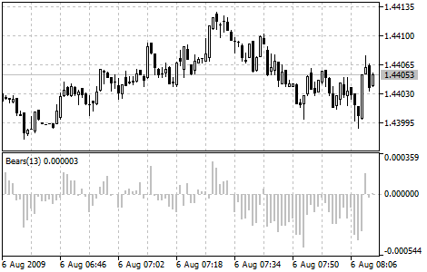

[🏠 Document Start](../../../README.md) / [Price Charts, Technical and Fundamental Analysis](../../README.md) / [Technical Indicators](../../Technical-Indicators.md) / [Oscillators](../Oscillators.md) / Bears Power

[Previous](Average-True-Range.md) | [Next](Bulls-Power.md)

# Bears Power

Everyday trading represents a battle of buyers ("Bulls") pushing prices up and sellers ("Bears") pushing prices down. Depending on what party scores off, the day will end with a price that is higher or lower than that of the previous day. Intermediate results, first of all the highest and lowest price, allow to judge about how the battle was developing during the day.

It is very important to be able to estimate the Bears Power balance since changes in this balance initially signalize about possible trend reversal. This task can be solved using the Bears Power oscillator developed by Alexander Elder and and described in his book titled Trading for a Living. Elder based on the following premises when deducing this oscillator:

  * moving average is a price agreement between sellers and buyers for a certain period of time,
  * the lowest price displays the maximum sellers' power within the day.

On these premises, Elder developed Bears Power as the difference between the lowest price and 13-period exponential moving average (LOW - EMA).

## Application

This indicator is better to use together with a trend indicator (most frequently Moving Average):

  * if trend indicator is up-directed and the Bears Power index is below zero, but growing, it is a signal to buy;
  * it is desirable that, in this case, the divergence of bases were being formed in the indicator chart.

> You can test the [trade signals](https://www.mql5.com/en/docs/standardlibrary/ExpertClasses/CSignal/signal_bears) of this indicator by creating an Expert Advisor in [MQL5 Wizard](https://www.metatrader5.com/en/automated-trading/mql5wizard).

## Calculation

The first stage of this indicator calculation is calculation of the exponential moving average (as a rule, it is recommended to use the 13-period EMA).

BEARS = LOW - EMA

Where:

BEARS — Bears' Power;  
LOW — the lowest price of the current bar;  
EMA — [Exponential Moving Average (#ema)](../Trend-Indicators/Moving-Average.md#ema).

In the down-trend, LOW is lower than EMA, so the Bears Power is below zero and histogram is located below zero line. If LOW rises above EMA when prices grow, the Bears Power becomes above zero and its histogram rises above zero line.
