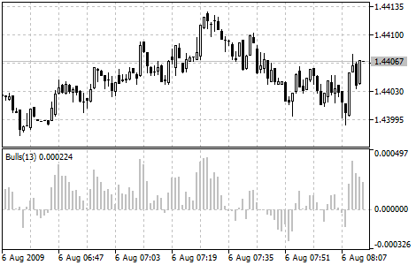

[🏠 Document Start](../../../README.md) / [Price Charts, Technical and Fundamental Analysis](../../README.md) / [Technical Indicators](../../Technical-Indicators.md) / [Oscillators](../Oscillators.md) / Bulls Power

[Previous](Bears-Power.md) | [Next](Chaikin-Oscillator.md)

# Bulls Power

Everyday trading represents a battle of buyers ("Bulls") pushing prices up and sellers ("Bears") pushing prices down. Depending on what party scores off, the day will end with a price that is higher or lower than that of the previous day. Intermediate results, first of all the highest and lowest price, allow to judge about how the battle was developing during the day.

It is very important to be able to estimate the Bulls Power balance since changes in this balance initially signalize about possible trend reversal. This task can be solved using the Bulls Power oscillator developed by Alexander Elder and and described in his book titled Trading for a Living. Elder based on the following premises when deducing this oscillator:

  * moving average is a price agreement between sellers and buyers for a certain period of time,
  * the highest price displays the maximum buyers' power within the day.

On these premises, Elder developed Bulls Power as the difference between the highest price and 13-period exponential moving average (HIGH - EMA).

## Application

This indicator is better to use together with a trend indicator (most frequently Moving Average):

  * if trend indicator is down-directed and the Bulls Power index is above zero, but falling, it is a signal to sell;
  * it is desirable that, in this case, the divergence of peaks were being formed in the indicator chart.

> You can test the [trade signals](https://www.mql5.com/en/docs/standardlibrary/ExpertClasses/CSignal/signal_bulls) of this indicator by creating an Expert Advisor in [MQL5 Wizard](https://www.metatrader5.com/en/automated-trading/mql5wizard).

## Calculation

The first stage of this indicator calculation is calculation of the exponential moving average (as a rule, it is recommended to use the 13-period EMA).

BULLS = HIGH - EMA

Where:

BULLS — Bulls' Power;  
HIGH — the highest price of the current bar;  
EMA — [Exponential Moving Average (#ema)](../Trend-Indicators/Moving-Average.md#ema).

In the up-trend, HIGH is higher than EMA, so the Bulls Power is above zero and histogram is located above zero line. If HIGH falls under EMA when prices fall, the Bulls Power becomes below zero and its histogram falls under zero line.
