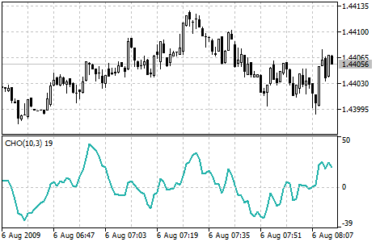

[🏠 Document Start](../../../README.md) / [Price Charts, Technical and Fundamental Analysis](../../README.md) / [Technical Indicators](../../Technical-Indicators.md) / [Oscillators](../Oscillators.md) / Chaikin Oscillator

[Previous](Bulls-Power.md) | [Next](Commodity-Channel-Index.md)

# Chaikin Oscillator

Chaikin's Oscillator (CHO) is the difference of moving averages of [Accumulation/Distribution](../Volume-Indicators/AccumulationDistribution.md).

"The concept of this oscillator is based on three main theses. First: if a share or an index is higher when it closes than it was during the day (you can calculate the average value as [max+min]/2), it means that it was a day of accumulation. The closer the closing index of a share or an index gets to the maximum, the more active the accumulation is. Vice versa, if a share's closing price is lower than the average level of the day, it means that distribution took place. The closer to the minimum the share gets, the more active is the distribution.

Second: stable price growth is accompanied by increase in trade volume and strong accumulation of the volume. As the volume is like fuel that feeds market growth, the lag of volume along with the growth of prices shows that there isn't enough fuel to continue the rise.

Vice versa, a slump in prices is usually accompanied by low amount and ends up in panic liquidation of positions by institutional investors. Therefore, first of all we see a growth of volume, then a slump in prices accompanied by reduced volume and finally, when the market is close to foundation, some accumulation takes place.

Third: with a Chaikin's oscillator you can trace back the volume of money resources coming in to the market and leaving it. Comparing the dynamics of volume and prices allows finding out peaks and foundations of the market, both short- and medium-term.

As there are no correct methods of technical analysis, I would recommend you using this oscillator along with other technical indicators. The reliability of short-term and medium-term trade signals will be higher if you use a Chaikin's oscillator together with, for example, [Envelopes](../Trend-Indicators/Envelopes.md) based on a 21-day moving average and some oscillator of outbidding/resale.

The most important signal arises when the prices reach a maximum or a minimum level (especially on the level of outbidding/resale), but the Chaikin's oscillator can't overcome its previous extremum and so it turns around.

  * Signals moving in the direction of the medium-term trend are more reliable than those moving against it.
  * The fact that an oscillator confirms a new maximum or minimum doesn't mean that the prices will move on in that direction. I regard this event as unimportant.

Another way of using Chaikin's oscillator implies the following: a change in its direction is a signal for purchase or a sale, but only if it coincides with the price trend direction. For example, if a share is on the rise and its price is higher than a 90-day moving average, then an up-turn of the oscillator curve in the area of negative values can be regarded as a signal for purchase (but the share price must be higher than a 90-day moving average - not less).

A down-turn of the oscillator curve in the area of positive values (above zero) can be regarded as a signal for sale, but the share price must be lower than the 90-day moving average of closing prices."

## Calculation

To calculate the Chaikin's oscillator, you must subtract a 10-period exponential moving average of [Accumulation/Distribution](../Volume-Indicators/AccumulationDistribution.md) indicator from a 3-period exponential moving average of the same indicator.

CHO = EMA (A/D, 3) - EMA (A/D, 10)

Where:

EMA — exponential moving average;  
A/D — value of the Accumulation/Distribution indicator.
