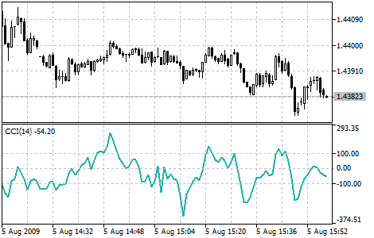

[🏠 Document Start](../../../README.md) / [Price Charts, Technical and Fundamental Analysis](../../README.md) / [Technical Indicators](../../Technical-Indicators.md) / [Oscillators](../Oscillators.md) / Commodity Channel Index

[Previous](Chaikin-Oscillator.md) | [Next](DeMarker.md)

# Commodity Channel Index

Commodity Channel Index Technical Indicator (CCI) measures the deviation of the commodity price from its average statistical price. High values of the index point out that the price is unusually high being compared with the average one, and low values show that the price is too low. In spite of its name, the Commodity Channel Index can be applied for any financial instrument, and not only for the wares.

There are two basic techniques of using Commodity Channel Index:

  1. Finding the divergences  
The divergence appears when the price reaches a new maximum, and Commodity Channel Index can not grow above the previous maximums. This classical divergence is normally followed by the price correction.
  2. As an indicator of overbuying/overselling  
Commodity Channel Index usually varies in the range of ±100. Values above +100 inform about overbuying state (and about a probability of correcting decay), and the values below 100 inform about the overselling state (and about a probability of correcting increase).

> You can test the [trade signals](https://www.mql5.com/en/docs/standardlibrary/ExpertClasses/CSignal/signal_cci) of this indicator by creating an Expert Advisor in [MQL5 Wizard](https://www.metatrader5.com/en/automated-trading/mql5wizard).

## Calculation

  1. To find a Typical Price. You need to add the HIGH, the LOW, and the CLOSE prices of each bar and then divide the result by 3:  
  
TP = (HIGH + LOW + CLOSE) / 3
  2. To calculate the n-period [Simple Moving Average (#sma)](../Trend-Indicators/Moving-Average.md#sma) of Typical Prices:  
  
SMA (TP, N) = SUM (TP, N) / N
  3. To subtract the received SMA(TP, N) from Typical Prices of each of preceding n periods:  
  
D = TP - SMA (TP, N)
  4. To calculate the n-period [Simple Moving Average](../Trend-Indicators/Moving-Average.md) of absolute D values:  
  
SMA (D, N) = SUM (D, N) / N
  5. To multiply the received SMA(D, N) by 0,015:  
  
M = SMA (D, N) * 0,015
  6. To divide M by D:  
  
CCI = M / D

Where:

HIGH — maximal bar price;  
LOW — minimal bar price;  
CLOSE — close price;  
SMA — [Simple Moving Average](../Trend-Indicators/Moving-Average.md);  
SUM — sum;  
N — number of periods used for calculation.
