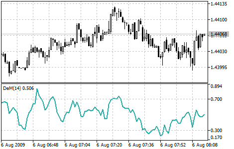

[🏠 Document Start](../../../README.md) / [Price Charts, Technical and Fundamental Analysis](../../README.md) / [Technical Indicators](../../Technical-Indicators.md) / [Oscillators](../Oscillators.md) / DeMarker

[Previous](Commodity-Channel-Index.md) | [Next](Force-Index.md)

# DeMarker

Demarker Technical Indicator (DeM) is based on the comparison of the period maximum with the previous period maximum. If the current period (bar) maximum is higher, the respective difference between the two will be registered. If the current maximum is lower or equaling the maximum of the previous period, the naught value will be registered. The differences received for N periods are then summed. The received value is used as the numerator of the DeMarker and will be divided by the same value plus the sum of differences between the price minima of the previous and the current periods (bars). If the current price minimum is greater than that of the previous bar, the naught value will be registered.

When the indicator falls below 30, the bullish price reversal should be expected. When the indicator rises above 70, the bearish price reversal should be expected.

If you use periods of longer duration, when calculating the indicator, you’ll be able to catch the long term market tendency. Indicators based on short periods let you enter the market at the point of the least risk and plan the time of transaction so that it falls in with the major trend.

> You can test the [trade signals](https://www.mql5.com/en/docs/standardlibrary/ExpertClasses/CSignal/signal_demarker) of this indicator by creating an Expert Advisor in [MQL5 Wizard](https://www.metatrader5.com/en/automated-trading/mql5wizard).

## Calculation

The value of the DeMarker for the "i" interval is calculated as follows:

DeMax (i) is calculated. If HIGH (i) > HIGH (i - 1), then:

DeMax (i) = HIGH (i) - HIGH (i - 1)

otherwise

DeMax (i) = 0

DeMin (i) is calculated. If LOW (i) < LOW (i - 1), then:

DeMin (i) = LOW (i - 1) - LOW (i)

otherwise

DeMin (i) = 0

The value of the DeMarker is calculated as:

DMark (i) = SMA (DeMax, N) / (SMA (DeMax, N) + SMA (DeMin, N))

Where:

HIGH (i) — the highest price of the current bar;  
LOW (i) — the lowest price of the current bar;  
HIGH (i - 1) — the highest price of the previous bar;  
LOW (i - 1) — the lowest price of the previous bar;  
SMA — [Simple Moving Average (#sma)](../Trend-Indicators/Moving-Average.md#sma);  
N — number of periods used for calculation.
