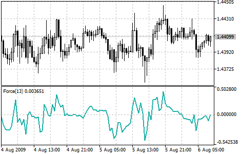

[🏠 Document Start](../../../README.md) / [Price Charts, Technical and Fundamental Analysis](../../README.md) / [Technical Indicators](../../Technical-Indicators.md) / [Oscillators](../Oscillators.md) / Force Index

[Previous](DeMarker.md) | [Next](MACD.md)

# Force Index

Force Index Technical Indicator was developed by Alexander Elder. This index measures the Bulls Power at each increase, and the Bears Power at each decrease. It connects the basic elements of market information: price trend, its drops, and volumes of transactions. This index can be used as it is, but it is better to approximate it with the help of [Moving Average](../Trend-Indicators/Moving-Average.md). Approximation with the help a short moving average (the author proposes to use 2 intervals) contributes to finding the best opportunity to open and close positions. If the approximations is made with long moving average (period 13), the index shows the trends and their changes.

  * It is better to buy when the forces become minus (fall below zero) in the period of indicator increasing tendency;
  * The force index signalizes the continuation of the increasing tendency when it increases to the new peak;
  * The signal to sell comes when the index becomes positive during the decreasing tendency;
  * The force index signalizes the Bears' Power and continuation of the decreasing tendency when the index falls to the new depth;
  * If price changes do not correlate to the corresponding changes in volume, the force indicator stays on one level, which tells you the trend is going to change soon.

## Calculation

The force of every market movement is characterized by its direction, scale and volume. If the closing price of the current bar is higher than the preceding bar, the force is positive. If the current closing price is lower than the preceding one, the force is negative. The greater the difference in prices is the greater the force is. The greater the transaction volume is the greater the force is.

FORCE INDEX (i) = VOLUME (i) * ((MA (ApPRICE, N, i) - MA (ApPRICE, N, i-1))

Where:

FORCE INDEX (i) — Force Index of the current bar;  
VOLUME (i) — volume of the current bar;  
MA (ApPRICE, N, i) — any [Moving Average](../Trend-Indicators/Moving-Average.md) of the current bar for N periods:  
[Simple (#sma)](../Trend-Indicators/Moving-Average.md#sma), [Exponential (#ema)](../Trend-Indicators/Moving-Average.md#ema), [Weighted (#lwma)](../Trend-Indicators/Moving-Average.md#lwma) or [Smoothed (#smma)](../Trend-Indicators/Moving-Average.md#smma);  
ApPRICE — applied price;  
N — period of smoothing;  
MA (ApPRICE, N, i-1) — any [Moving Average](../Trend-Indicators/Moving-Average.md) of the previous bar.
