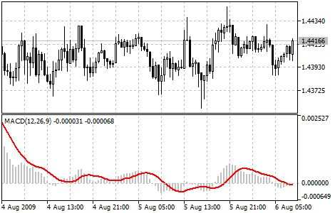

[🏠 Document Start](../../../README.md) / [Price Charts, Technical and Fundamental Analysis](../../README.md) / [Technical Indicators](../../Technical-Indicators.md) / [Oscillators](../Oscillators.md) / MACD

[Previous](Force-Index.md) | [Next](Momentum.md)

# MACD

Moving Average Convergence/Divergence (MACD) is a trend-following dynamic indicator. It indicates the correlation between two [Moving Averages](../Trend-Indicators/Moving-Average.md) of a price.

The Moving Average Convergence/Divergence (MACD) Technical Indicator is the difference between a 26-period and 12-period [Exponential moving averages (EMA) (#ema)](../Trend-Indicators/Moving-Average.md#ema). In order to clearly show buy/sell opportunities, a so-called signal line (9-period moving average of the indicator) is plotted on the MACD chart.

The MACD proves most effective in wide-swinging trading markets. There are three popular ways to use the Moving Average Convergence/Divergence: crossovers, overbought/oversold conditions, and divergences.

## Crossovers

The basic MACD trading rule is to sell when the MACD falls below its signal line. Similarly, a buy signal occurs when the Moving Average Convergence/Divergence rises above its signal line. It is also popular to buy/sell when the MACD goes above/below zero.

## Overbought/Oversold Conditions

The MACD is also useful as an overbought/oversold indicator. When the shorter moving average pulls away dramatically from the longer moving average (i.e., the MACD rises), it is likely that the symbol price is overextending and will soon return to more realistic levels.

## Divergence

An indication that an end to the current trend may be near occurs when the MACD diverges from the symbol. A bullish divergence occurs when the Moving Average Convergence/Divergence indicator is making new highs while prices fail to reach new highs. A bearish divergence occurs when the MACD is making new lows while prices fail to reach new lows. Both of these divergences are most significant when they occur at relatively overbought/oversold levels.

> You can test the [trade signals](https://www.mql5.com/en/docs/standardlibrary/ExpertClasses/CSignal/signal_macd) of this indicator by creating an Expert Advisor in [MQL5 Wizard](https://www.metatrader5.com/en/automated-trading/mql5wizard).

## Calculation

The MACD is calculated by subtracting the value of a 26-period exponential moving average from a 12-period exponential moving average. A 9-period dotted simple moving average of the MACD (the signal line) is then plotted on top of the MACD.

MACD = EMA(CLOSE, 12) - EMA(CLOSE, 26)

SIGNAL = SMA(MACD, 9)

Where:

EMA — Exponential Moving Average;  
SMA — Simple Moving Average;  
SIGNAL — the signal line of the indicator.
