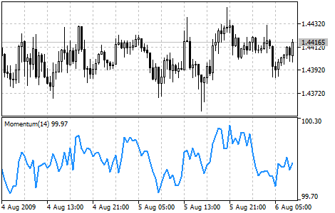

[🏠 Document Start](../../../README.md) / [Price Charts, Technical and Fundamental Analysis](../../README.md) / [Technical Indicators](../../Technical-Indicators.md) / [Oscillators](../Oscillators.md) / Momentum

[Previous](MACD.md) | [Next](Moving-Average-of-Oscillator.md)

# Momentum

The Momentum Technical Indicator measures the change of price of a financial instrument over a given time span. There are basically two ways to use the Momentum indicator:

  * As a trend-following indicator analogous to [Moving Average Convergence/Divergence (MACD)](MACD.md). In this case a signal to buy occurs if the Momentum indicator makes up a trough and starts rising; a signal to sell occurs when it reaches peak and turns down. You may want to plot a short-term moving average of the indicator to determine when it is bottoming or peaking.  
Extremely high or low values of Momentum imply continuation of the current trend. Thus if the indicator reaches extremely high values and then turns down, the further price growth should be expected. In any case, a position should be opened or closed only after prices confirm the signal generated by the indicator.
  * As a leading indicator. This method assumes that the final phase of an up-trend is usually accompanied by a rapid price increase (when everyone expects prices to go higher), and that the end of bears' market is characterized by rapid price declines (when everyone wants to get out). This is often the case, but it is also a broad generalization.  
When market approaches a peak there is a sharp leap of the Momentum indicator. After that it starts to fall while prices keep on growing or move horizontally. Analogous to that, at the market bottom Momentum sharply falls and then turns up long before prices start growing. Both of these situations result in divergences between the indicator and prices.

## Calculation

Momentum is calculated as a ratio of today’s price to the price n periods ago:

MOMENTUM = CLOSE (i) / CLOSE (i - n) * 100

Where:

CLOSE (i) — close price of the current bar;  
CLOSE (i - n) — close price n bars ago.
