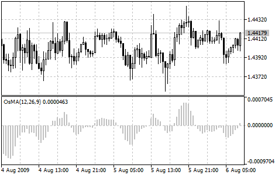

[🏠 Document Start](../../../README.md) / [Price Charts, Technical and Fundamental Analysis](../../README.md) / [Technical Indicators](../../Technical-Indicators.md) / [Oscillators](../Oscillators.md) / Moving Average of Oscillator

[Previous](Momentum.md) | [Next](Relative-Strength-Index.md)

# Moving Average of Oscillator

Moving Average of Oscillator (OsMA) is the difference between the oscillator and oscillator smoothing. In this case, Moving Average Convergence/Divergence base-line is used as the oscillator, and the signal line is used as the smoothing.

## Calculation

OSMA = MACD - SIGNAL
