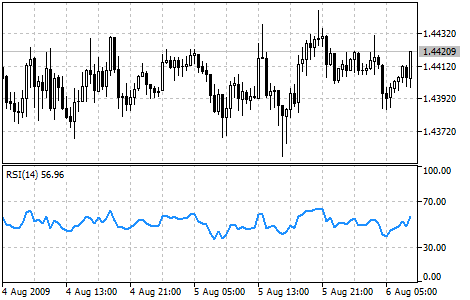

[🏠 Document Start](../../../README.md) / [Price Charts, Technical and Fundamental Analysis](../../README.md) / [Technical Indicators](../../Technical-Indicators.md) / [Oscillators](../Oscillators.md) / Relative Strength Index

[Previous](Moving-Average-of-Oscillator.md) | [Next](Relative-Vigor-Index.md)

# Relative Strength Index

The Relative Strength Index Technical Indicator (RSI) is a price-following oscillator that ranges between 0 and 100. When Wilder introduced the Relative Strength Index, he recommended using a 14-period RSI. Since then, the 9-period and 25-period Relative Strength Index indicators have also gained popularity. A popular method of analyzing the RSI is to look for a divergence in which the security is making a new high, but the RSI is failing to surpass its previous high. This divergence is an indication of an impending reversal. When the Relative Strength Index then turns down and falls below its most recent trough, it is said to have completed a "failure swing". The failure swing is considered a confirmation of the impending reversal.

The following signals of Relative Strength Index are used in chart analyzing:

  * Tops and Bottoms  
The Relative Strength Index usually tops above 70 and bottoms below 30. It usually forms these tops and bottoms before the underlying price chart.
  * Chart Formations  
The RSI often forms chart patterns such as head and shoulders or triangles that may be or may not be visible on the price chart.
  * Failure Swing (Support or Resistance breakout)  
This is where the Relative Strength Index surpasses a previous high (peak) or falls below a recent low (trough).
  * Support and Resistance levels  
The Relative Strength Index shows, sometimes more clearly than price themselves, levels of support and resistance.
  * Divergences  
As discussed above, divergences occur when the price makes a new high (or low) that is not confirmed by a new high (or low) in the Relative Strength Index. Prices usually correct and move in the direction of the RSI.

> You can test the [trade signals](https://www.mql5.com/en/docs/standardlibrary/ExpertClasses/CSignal/signal_rsi) of this indicator by creating an Expert Advisor in [MQL5 Wizard](https://www.metatrader5.com/en/automated-trading/mql5wizard).

## Calculation

This is the main formula of Relative Strength Index calculation:

RSI = 100 - (100 / (1 + U / D))

Where:

U — average number of positive price changes;  
D — average number of negative price changes.
