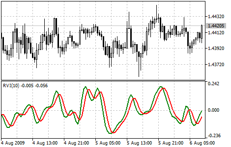
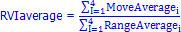

[🏠 Document Start](../../../README.md) / [Price Charts, Technical and Fundamental Analysis](../../README.md) / [Technical Indicators](../../Technical-Indicators.md) / [Oscillators](../Oscillators.md) / Relative Vigor Index

[Previous](Relative-Strength-Index.md) | [Next](Stochastic-Oscillator.md)

# Relative Vigor Index

The main point of Relative Vigor Index Technical Indicator (RVI) is that on the bull market the closing price is, as a rule, higher, than the opening price. It is the other way round on the bear market. So the idea behind Relative Vigor Index is that the vigor, or energy, of the move is thus established by where the prices end up at the close. To normalize the index to the daily trading range, divide the change of price by the maximum range of prices for the day. To make a more smooth calculation, one uses [Simple Moving Average (#sma)](../Trend-Indicators/Moving-Average.md#sma). 10 is considered the best period. To avoid probable ambiguity one needs to construct a signal line, which is a 4-period symmetrically weighted moving average of Relative Vigor Index values. The concurrence of lines serves as a signal to buy or to sell.

> You can test the [trade signals](https://www.mql5.com/en/docs/standardlibrary/ExpertClasses/CSignal/signal_rvi) of this indicator by creating an Expert Advisor in [MQL5 Wizard](https://www.metatrader5.com/en/automated-trading/mql5wizard).

## Calculation

RVI is calculated similarly to [Stochastic Oscillator](Stochastic-Oscillator.md). However, the Vigor Index compares close levels relative to opening levels, and not the minimal price as is done by Stochastic. The indicator is calculated as the value equal to the actual price change for the period, normalized to the maximal range of price change for this period, for example a day or hour.

RVI = (CLOSE - OPEN) / (HIGH - LOW) 

Where:

OPEN — opening price;  
HIGH — highest price;  
LOW — lowest price;  
CLOSE — closing price.

Usually RVI is displayed as two lines:

1\. The first one is build the same as RVI, but instead of Close and Open price difference and High and Low price difference sums of 4-period symmetrically weighted moving averages are used. I.e. the 4-period symmetrically weighted average of a numerator is calculated:

MovAverage = (CLOSE-OPEN) + 2 * (CLOSE-1 - OPEN-1) + 2 * (CLOSE-2 - OPEN-2) + (CLOSE-3 - OPEN-3)

Where:

CLOSE — current close price;  
CLOSE-1, CLOSE-2, CLOSE-3 — close prices 1, 2 and 3 periods ago;  
OPEN — current open price;  
OPEN-1, OPEN-2, OPEN-3 — open prices 1, 2 and 3 periods ago.

Then the 4-period symmetrically weighted moving average of a denominator is found:

RangeAverage = (HIGH-LOW) + 2 x (HIGH-1 - LOW-1) + 2 x (HIGH-2 - LOW-2) + (HIGH-3 - LOW-3),

Where:

HIGH — maximal price of the last bar;  
HIGH, HIGH-2, HIGH-3 — maximal prices 1, 2 and 3 periods ago;  
LOW — minimal price of the last bar;  
LOW-1, LOW-2, LOW-3 — minimal prices 1, 2 and 3 periods ago.

After that we calculate the sum of these moving averages for the last 4 periods, for example hours or days:

2\. The second line is the 4-period symmetrically weighted moving average of the first line:

RVIsignal = (RVIaverage + 2 * RVIaverage-1 + 2 * RVIaverage-2 + RVIaverage-3)/6
