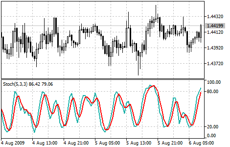

[🏠 Document Start](../../../README.md) / [Price Charts, Technical and Fundamental Analysis](../../README.md) / [Technical Indicators](../../Technical-Indicators.md) / [Oscillators](../Oscillators.md) / Stochastic Oscillator

[Previous](Relative-Vigor-Index.md) | [Next](Triple-Exponential-Average.md)

# Stochastic Oscillator

The Stochastic Oscillator Technical Indicator compares where a security’s price closed relative to its price range over a given time period. The Stochastic Oscillator is displayed as two lines. The main line is called %K. The second line, called %D, is a [Moving Average](../Trend-Indicators/Moving-Average.md) of %K. The %K line is usually displayed as a solid line and the %D line is usually displayed as a dotted line. There are several ways to interpret a Stochastic Oscillator. Three popular methods include:

  * Buy when the Oscillator (either %K or %D) falls below a specific level (for example, 20) and then rises above that level. Sell when the Oscillator rises above a specific level (for example, 80) and then falls below that level.
  * Buy when the %K line rises above the %D line and sell when the %K line falls below the %D line.
  * Look for divergences. For instance: where prices are making a series of new highs and the Stochastic Oscillator is failing to surpass its previous highs.

> You can test the [trade signals](https://www.mql5.com/en/docs/standardlibrary/ExpertClasses/CSignal/signal_stochastic) of this indicator by creating an Expert Advisor in [MQL5 Wizard](https://www.metatrader5.com/en/automated-trading/mql5wizard).

## Calculation

Four variables are used for the calculation of the Stochastic Oscillator:

  * %K periods. This is the number of time periods used in the stochastic calculation.
  * %K Slowing Periods. This value controls the internal smoothing of %K. A value of 1 is considered a fast stochastic; a value of 3 is considered a slow stochastic.
  * %D periods. This is the number of time periods used when calculating a moving average of %K.
  * %D method. The method (i.e., Exponential, Simple, Smoothed, or Weighted) that is used to calculate %D.

The formula for %K is:

%K = (CLOSE - MIN (LOW (%K))) / (MAX (HIGH (%K)) - MIN (LOW (%K))) * 100 

Where:

CLOSE — today’s closing price;  
MIN (LOW (%K)) — the lowest minimum in %K periods;  
MAX (HIGH (%K)) — the highest maximum in %K periods.

The %D moving average is calculated according to the formula:

%D = SMA (%K, N) 

Where:

N — smoothing period;  
SMA — [Simple Moving Average (#sma)](../Trend-Indicators/Moving-Average.md#sma).
