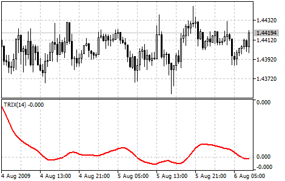

[🏠 Document Start](../../../README.md) / [Price Charts, Technical and Fundamental Analysis](../../README.md) / [Technical Indicators](../../Technical-Indicators.md) / [Oscillators](../Oscillators.md) / Triple Exponential Average

[Previous](Stochastic-Oscillator.md) | [Next](Williams'-Percent-Range.md)

# Triple Exponential Average

Triple Exponential Average (TRIX) was developed by Jack Hutson as an oscillator of the overbought/oversold market conditions. It can also be used as the Momentum indicator. Triple smoothing is used for removing the cyclic components in price movements with the period less than that of TRIX.

The zone is used as the indicator of overbought or oversold state (positive and negative respectively). The signal to buy is crossing of the zero line from below, or "bulls'" divergence; the signal to sell is the indicator's crossing the zero line from above, or "bears'" divergence with prices. The distinctive feature of the indicator is the perfect filtration of price noises and absence of lag that is so typical of most moving averages.

> You can test the [trade signals](https://www.mql5.com/en/docs/standardlibrary/ExpertClasses/CSignal/signal_trix) of this indicator by creating an Expert Advisor in [MQL5 Wizard](https://www.metatrader5.com/en/automated-trading/mql5wizard).

## Calculation

First the Exponential Moving Average of a price is calculated:

EMA1(i) = EMA(Price, N, i)

Where:

Price(i) — current price;  
N — EMA period;  
EMA1(i) — current value of the [Exponential Moving Average (#ema)](../Trend-Indicators/Moving-Average.md#ema).

Then the second smoothing of the obtained average is performed - double exponential smoothing:

EMA2(i) = EMA(EMA1, N, i).

The double Exponential Moving Average is smoothed exponentially once again - we get the Triple Exponential Moving Average:

EMA3(i) = EMA(EMA2, N, i);

Now the indicator itself is calculated:

TRIX(i) = (EMA3(i) - EMA3(i - 1))/ EMA3(i-1)
