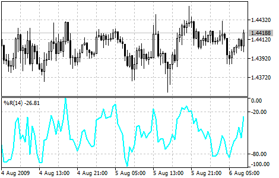

[🏠 Document Start](../../../README.md) / [Price Charts, Technical and Fundamental Analysis](../../README.md) / [Technical Indicators](../../Technical-Indicators.md) / [Oscillators](../Oscillators.md) / Williams' Percent Range

[Previous](Triple-Exponential-Average.md) | [Next](../Volume-Indicators.md)

# Williams’ Percent Range

Williams’ Percent Range Technical Indicator (%R) is a dynamic technical indicator, which determines whether the market is overbought/oversold. Williams’ %R is very similar to the [Stochastic Oscillator](Stochastic-Oscillator.md). The only difference is that %R has an upside down scale and the Stochastic Oscillator has internal smoothing.

Indicator values ranging between -80% and -100% indicate that the market is oversold. Indicator values ranging between -0% and -20% indicate that the market is overbought. To show the indicator in this upside down fashion, one places a minus symbol before the Williams' Percent Range values (for example -30%). One should ignore the minus symbol when conducting the analysis.

As with all overbought/oversold indicators, it is best to wait for the symbol price to change direction before placing your trades. For example, if an overbought/oversold indicator is showing an overbought condition, it is wise to wait for the security’s price to turn down before selling the security.

An interesting phenomenon of the Williams' Percent Range indicator is its uncanny ability to anticipate a reversal in the underlying security’s price. The indicator almost always forms a peak and turns down a few days before the security’s price peaks and turns down. Likewise, Williams Percent Range usually creates a trough and turns up a few days before the security’s price turns up.

> You can test the [trade signals](https://www.mql5.com/en/docs/standardlibrary/ExpertClasses/CSignal/signal_wpr) of this indicator by creating an Expert Advisor in [MQL5 Wizard](https://www.metatrader5.com/en/automated-trading/mql5wizard).

## Calculation

Below is the formula of the %R indicator calculation, which is very similar to the [Stochastic Oscillator](Stochastic-Oscillator.md) formula:

%R = -(MAX (HIGH (i - n)) - CLOSE (i)) / (MAX (HIGH (i - n)) - MIN (LOW (i - n))) * 100 

Where:

CLOSE (i) — today's closing price;  
MAX (HIGH (i - n)) — the highest maximum over a number (n) of previous periods;  
MIN (LOW (i - n)) — the lowest minimum over a number (n) of previous periods.
