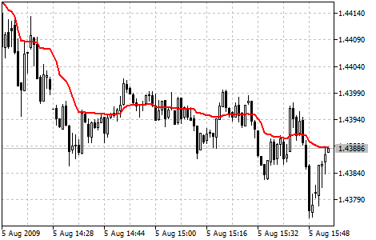

[🏠 Document Start](../../../README.md) / [Price Charts, Technical and Fundamental Analysis](../../README.md) / [Technical Indicators](../../Technical-Indicators.md) / [Trend Indicators](../Trend-Indicators.md) / Adaptive Moving Average

[Previous](../Trend-Indicators.md) | [Next](Average-Directional-Movement-Index.md)

# Adaptive Moving Average

Adaptive Moving Average (AMA) Technical Indicator is used for constructing a moving average with low sensitivity to price series noises and is characterized by the minimal lag for trend detection. This indicator was developed and described by Perry Kaufman in his book "Smarter Trading".

One of disadvantages of different smoothing algorithms for price series is that accidental price leaps can result in the appearance of false trend signals. On the other hand, smoothing leads to the unavoidable lag of a signal about trend stop or change. This indicator was developed for eliminating these two disadvantages.

> You can test the [trade signals](https://www.mql5.com/en/docs/standardlibrary/ExpertClasses/CSignal/signal_ama) of this indicator by creating an Expert Advisor in [MQL5 Wizard](https://www.metatrader5.com/en/automated-trading/mql5wizard).

## Calculation

To define the current market state Kaufman introduced the notion of Efficiency Ratio (ER), which is calculated by the below formula:

ER(i) = Signal(i)/Noise(i)

Where:

ER(i) — current value of the Efficiency Ratio;  
Signal(i) = ABS(Price(i) - Price(i - N)) — current signal value, absolute value of difference between the current price and price N period ago;  
Noise(i) = Sum(ABS(Price(i) - Price(i-1)),N) — current noise value, sum of absolute values of the difference between the price of the current period and price of the previous period for N periods.

At a strong trend the Efficiency Ratio (ER) will tend to 1; if there is no directed movement, it will be a little more than 0. The obtained value of ER is used in the exponential smoothing formula:

EMA(i) = Price(i) * SC + EMA(i-1) * (1 - SC)

Where:

SC = 2/(n+1) — EMA smoothing constant, n — period of the exponential moving;  
EMA(i-1) — previous value of EMA.

The smoothing ratio for the fast market must be as for EMA with period 2 (fast SC = 2/(2+1) = 0.6667), and for the period of no trend EMA period must be equal to 30 (slow SC = 2/(30+1) = 0.06452). Thus the new changing smoothing constant is introduced (scaled smoothing constant) SSC:

SSC(i) = (ER(i) * ( fast SC - slow SC) + slow SC

or

SSC(i) = ER(i) * 0.60215 + 0.06425

For a more efficient influence of the obtained smoothing constant on the averaging period Kaufman recommends squaring it.

Final calculation formula:

AMA(i) = Price(i) * (SSC(i)^2) + AMA(i-1)*(1-SSC(i)^2)

or (after rearrangement):

AMA(i) = AMA(i-1) + (SSC(i)^2) * (Price(i) - AMA(i-1))

Where:

AMA(i) — current value of AMA;  
AMA(i—1) — previous value of AMA;  
SSC(i) — current value of the scaled smoothing constant.
