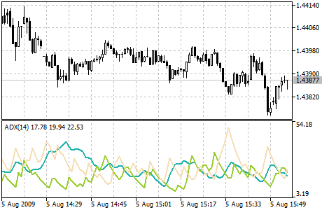

[🏠 Document Start](../../../README.md) / [Price Charts, Technical and Fundamental Analysis](../../README.md) / [Technical Indicators](../../Technical-Indicators.md) / [Trend Indicators](../Trend-Indicators.md) / Average Directional Movement Index

[Previous](Adaptive-Moving-Average.md) | [Next](Average-Directional-Movement-Index-Wilder.md)

# Average Directional Movement Index

Average Directional Movement Index Technical Indicator (ADX) helps to determine if there is a price trend. It was developed and described in detail by Welles Wilder in his book "New concepts in technical trading systems".

The simplest trading method based on the system of directional movement implies comparison of two direction indicators: the 14-period +DI one and the 14-period -DI. To do this, one either puts the charts of indicators one on top of the other, or +DI is subtracted from -DI. W. Wilder recommends buying when +DI is higher than -DI, and selling when +DI sinks lower than -DI.

To these simple commercial rules Welles Wilder added "a rule of points of extremum". It is used to eliminate false signals and decrease the number of deals. According to the principle of points of extremum, the "point of extremum" is the point when +DI and -DI cross each other. If +DI raises higher than -DI, this point will be the maximum price of the day when they cross. If +DI is lower than -DI, this point will be the minimum price of the day they cross.

The point of extremum is used then as the market entry level. Thus, after the signal to buy (+DI is higher than -DI) one must wait till the price has exceeded the point of extremum, and only then buy. However, if the price fails to exceed the level of the point of extremum, one should retain the short position.

## Calculation

ADX = SUM ((+DI - (-DI)) / (+DI + (-DI)), N) / N 

Where:

N — the number of periods used in the calculation;  
SUM (..., N) — sum for N periods;  
+DI — value of the indicator of the positive price movement (positive directional index);  
-DI — value of the indicator of the negative price movement (negative directional index).
