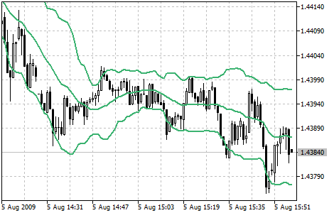

[🏠 Document Start](../../../README.md) / [Price Charts, Technical and Fundamental Analysis](../../README.md) / [Technical Indicators](../../Technical-Indicators.md) / [Trend Indicators](../Trend-Indicators.md) / Bollinger Bands

[Previous](Average-Directional-Movement-Index-Wilder.md) | [Next](Double-Exponential-Moving-Average.md)

# Bollinger Bands®

Bollinger Bands (BB) are similar to [Envelopes](Envelopes.md). The only difference is that the bands of Envelopes are plotted a fixed distance (%) away from the [moving average](Moving-Average.md), while the Bollinger Bands are plotted a certain number of standard deviations away from it. Standard deviation is a measure of volatility, therefore Bollinger Bands adjust themselves to the market conditions. When the markets become more volatile, the bands widen and they contract during less volatile periods.

Bollinger Bands are usually drawn on the price chart, but they can be also added to the indicator chart. Just like in case of the [Envelopes](Envelopes.md), the interpretation of the Bollinger Bands is based on the fact that the prices tend to remain in between the top and the bottom line of the bands. A distinctive feature of the Bollinger Band indicator is its variable width due to the volatility of prices. In periods of considerable price changes (i.e. of high volatility) the bands widen leaving a lot of room to the prices to move in. During standstill periods, or the periods of low volatility the band contracts keeping the prices within their limits.

The following traits are particular to the Bollinger Band:

  1. abrupt changes in prices tend to happen after the band has contracted due to decrease of volatility;
  2. if prices break through one of the bands, a continuation of the current trend is to be expected;
  3. if the pikes and hollows outside the band are followed by pikes and hollows inside the band, a reverse of trend may occur;
  4. the price movement that has started from one of the band’s lines usually reaches the opposite one.

The last observation is useful for forecasting price guideposts.

## Calculation

Bollinger bands are formed by three lines. The middle line (ML) is a usual [Moving Average](Moving-Average.md).

ML = SUM (CLOSE, N) / N = SMA (CLOSE, N)

The top line (TL) is the same as the middle line shifted up by a certain number of standard deviations (D).

TL = ML + (D * StdDev)

The bottom line (BL) is the middle line shifted down by the same number of standard deviations.

BL = ML - (D * StdDev)

Where:

SUM (..., N) is the sum for N periods;  
CLOSE is the close price;  
N is the number of period used for calculations;  
SMA is a [simple moving average (#sma)](Moving-Average.md#sma);  
SQRT is a square root;  
StdDev means standard deviation:

StdDev = SQRT (SUM ((CLOSE — SMA (CLOSE, N))^2, N)/N) 

It is recommended to use 20-period Simple Moving Average as the middle line, and plot top and bottom lines two standard deviations away from it. Besides, moving averages of less than 10 periods are of little effect.
