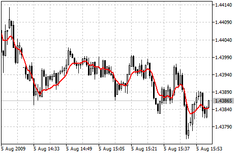

[🏠 Document Start](../../../README.md) / [Price Charts, Technical and Fundamental Analysis](../../README.md) / [Technical Indicators](../../Technical-Indicators.md) / [Trend Indicators](../Trend-Indicators.md) / Double Exponential Moving Average

[Previous](Bollinger-Bands.md) | [Next](Envelopes.md)

# Double Exponential Moving Average

Double Exponential Moving Average Technical Indicator (DEMA) was developed by Patrick Mulloy and published in February 1994 in the "Technical Analysis of Stocks & Commodities" magazine. It is used for smoothing price series and is applied directly on a price chart of a financial security. Besides, it can be used for smoothing values of other indicators.

The advantage of this indicator is that it eliminates false signals at the saw-toothed price movement and allows saving a position at a strong trend.

> You can test the [trade signals](https://www.mql5.com/en/docs/standardlibrary/ExpertClasses/CSignal/signal_dema) of this indicator by creating an Expert Advisor in [MQL5 Wizard](https://www.metatrader5.com/en/automated-trading/mql5wizard).

## Calculation

This indicator is based on the [Exponential Moving Average (#ema)](Moving-Average.md#ema) (EMA). Let's view the error of price deviation from EMA value:

err(i) = Price(i) - EMA(Price, N, i)

Where:

err(i) — current EMA error;  
Price(i) — current price;  
EMA(Price, N, i) — current EMA value of Price series with N period.

Let's add the value of the exponential average error to the value of the exponential moving average of a price and we will receive DEMA:

DEMA(i) = EMA(Price, N, i) + EMA(err, N, i) = EMA(Price, N, i) + EMA(Price - EMA(Price, N, i), N, i) =

= 2 * EMA(Price, N, i) - EMA(Price - EMA(Price, N, i), N, i) = 2 * EMA(Price, N, i) - EMA2(Price, N, i)

Where:

EMA(err, N, i) — current value of the exponential average of error err;  
EMA2(Price, N, i) — current value of the double consequential smoothing of prices.
