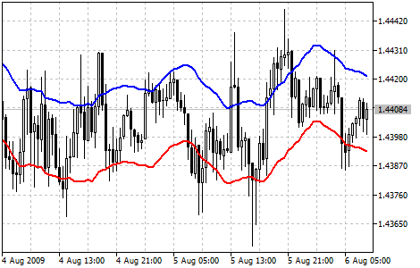

[🏠 Document Start](../../../README.md) / [Price Charts, Technical and Fundamental Analysis](../../README.md) / [Technical Indicators](../../Technical-Indicators.md) / [Trend Indicators](../Trend-Indicators.md) / Envelopes

[Previous](Double-Exponential-Moving-Average.md) | [Next](Fractal-Adaptive-Moving-Average.md)

# Envelopes

Envelopes Technical Indicator is formed with two [Moving Averages](Moving-Average.md), one of which is shifted upward and another one is shifted downward. The selection of optimum relative number of band margins shifting is determined with the market volatility: the higher the latter is, the stronger the shift is.

Envelopes define the upper and the lower margins of the price range. Signal to sell appears when the price reaches the upper margin of the band; signal to buy appears when the price reaches the lower margin.

The logic behind envelopes is that overzealous buyers and sellers push the price to the extremes (i.e., the upper and lower bands), at which point the prices often stabilize by moving to more realistic levels. This is similar to the interpretation of [Bollinger Bands® (BB)](Bollinger-Bands.md).

> You can test the [trade signals](https://www.mql5.com/en/docs/standardlibrary/ExpertClasses/CSignal/signal_envelopes) of this indicator by creating an Expert Advisor in [MQL5 Wizard](https://www.metatrader5.com/en/automated-trading/mql5wizard).

## Calculation

UPPER BAND = SMA (CLOSE, N) * [1 + K / 1000]

LOWER BAND = SMA (CLOSE, N) * [1 - K / 1000]

Where:

UPPER BAND — upper line of the indicator;  
LOWER BAND — lower line of the indicator;  
SMA — [Simple Moving Average (#sma)](Moving-Average.md#sma);  
CLOSE — close price;  
N — period of averaging;  
K / 1000 — the value of shifting from the average (measured in basis points).
