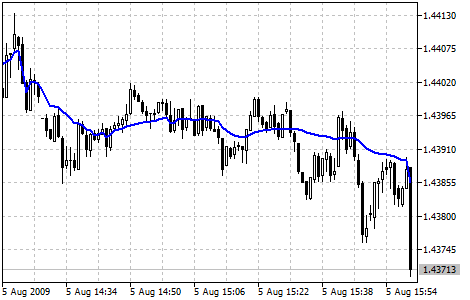

[🏠 Document Start](../../../README.md) / [Price Charts, Technical and Fundamental Analysis](../../README.md) / [Technical Indicators](../../Technical-Indicators.md) / [Trend Indicators](../Trend-Indicators.md) / Fractal Adaptive Moving Average

[Previous](Envelopes.md) | [Next](Ichimoku-Kinko-Hyo.md)

# Fractal Adaptive Moving Average

Fractal Adaptive Moving Average Technical Indicator (FRAMA) was developed by John Ehlers. This indicator is constructed based on the algorithm of the [Exponential Moving Average (#ema)](Moving-Average.md#ema), in which the smoothing factor is calculated based on the current fractal dimension of the price series. The advantage of FRAMA is the possibility to follow strong trend movements and to sufficiently slow down at the moments of price consolidation.

All types of analysis used for [Moving Averages](Moving-Average.md) can be applied to this indicator.

> You can test the [trade signals](https://www.mql5.com/en/docs/standardlibrary/ExpertClasses/CSignal/signal_frama) of this indicator by creating an Expert Advisor in [MQL5 Wizard](https://www.metatrader5.com/en/automated-trading/mql5wizard).

## Calculation

FRAMA(i) = A(i) * Price(i) + (1 - A(i)) * FRAMA(i-1)

Where:

FRAMA(i) — current value of FRAMA;  
Price(i) — current price;  
FRAMA(i-1) — previous value of FRAMA;  
A(i) — current factor of exponential smoothing.

Exponential smoothing factor is calculated according to the below formula:

A(i) = EXP(-4.6 * (D(i) - 1))

Where:

D(i) — current fractal dimension;  
EXP() — mathematical function of exponent.

Fractal dimension of a straight line is equal to one. It is seen from the formula that if D = 1, then A = EXP(-4.6 *(1-1)) = EXP(0) = 1. Thus if price changes in straight lines, exponential smoothing is not used, because in such a case the formula looks like this::

FRAMA(i) = 1 * Price(i) + (1 — 1) * FRAMA(i—1) = Price(i)

I.e. the indicator exactly follows the price.

The fractal dimension of a plane is equal to two. From the formula we get that if D = 2, then the smoothing factor A = EXP(-4.6*(2-1)) = EXP(-4.6) = 0.01. Such a small value of the exponential smoothing factor is obtained at moments when price makes a strong saw-toothed movement. Such a strong slow-down corresponds to approximately 200-period simple moving average.

Formula of fractal dimension:

D = (LOG(N1 + N2) - LOG(N3))/LOG(2)

It is calculated based on the additional formula:

N(Length,i) = (HighestPrice(i) - LowestPrice(i))/Length

Where:

HighestPrice(i) — current maximal value for Length periods;  
LowestPrice(i) — current minimal value for Length periods;

Values N1, N2 and N3 are respectively equal to:

N1(i) = N(Length,i)

N2(i) = N(Length,i + Length)

N3(i) = N(2 * Length,i)
