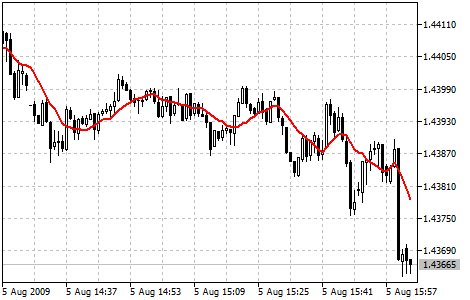

[🏠 Document Start](../../../README.md) / [Price Charts, Technical and Fundamental Analysis](../../README.md) / [Technical Indicators](../../Technical-Indicators.md) / [Trend Indicators](../Trend-Indicators.md) / Moving Average

[Previous](Ichimoku-Kinko-Hyo.md) | [Next](Parabolic-SAR.md)

# Moving Average (#moving-average)

The Moving Average Technical Indicator shows the mean instrument price value for a certain period of time. When one calculates the moving average, one averages out the instrument price for this time period. As the price changes, its moving average either increases, or decreases.

There are four different types of moving averages: [Simple (#sma)](Moving-Average.md#sma) (also referred to as Arithmetic), [Exponential (#ema)](Moving-Average.md#ema), [Smoothed (#smma)](Moving-Average.md#smma) and [Weighted (#lwma)](Moving-Average.md#lwma). Moving Average may be calculated for any sequential data set, including opening and closing prices, highest and lowest prices, trading volume or any other indicators. It is often the case when double moving averages are used.

The only thing where moving averages of different types diverge considerably from each other, is when weight coefficients, which are assigned to the latest data, are different. In case we are talking of [Simple Moving Average (#sma)](Moving-Average.md#sma), all prices of the time period in question are equal in value. [Exponential Moving Average (#ema)](Moving-Average.md#ema) and [Linear Weighted Moving Average (#lwma)](Moving-Average.md#lwma) attach more value to the latest prices.

The most common way to interpreting the price moving average is to compare its dynamics to the price action. When the instrument price rises above its moving average, a buy signal appears, if the price falls below its moving average, what we have is a sell signal. 

This trading system, which is based on the moving average, is not designed to provide entrance into the market right in its lowest point, and its exit right on the peak. It allows to act according to the following trend: to buy soon after the prices reach the bottom, and to sell soon after the prices have reached their peak.

Moving averages may also be applied to indicators. That is where the interpretation of indicator moving averages is similar to the interpretation of price moving averages: if the indicator rises above its moving average, that means that the ascending indicator movement is likely to continue: if the indicator falls below its moving average, this means that it is likely to continue going downward.

Here are the types of moving averages on the chart:

  * Simple Moving Average (SMA)
  * Exponential Moving Average (EMA)
  * Smoothed Moving Average (SMMA)
  * Linear Weighted Moving Average (LWMA)

> You can test the [trade signals](https://www.mql5.com/en/docs/standardlibrary/ExpertClasses/CSignal/signal_ma) of this indicator by creating an Expert Advisor in [MQL5 Wizard](https://www.metatrader5.com/en/automated-trading/mql5wizard).

## Calculation (#calculation)

### Simple Moving Average (SMA) (#sma)

Simple, in other words, arithmetical moving average is calculated by summing up the prices of instrument closure over a certain number of single periods (for instance, 12 hours). This value is then divided by the number of such periods. 

SMA = SUM (CLOSE (i), N) / N 

Where:

SUM — sum;  
CLOSE (i) — current period close price;  
N — number of calculation periods.

### Exponential Moving Average (EMA) (#ema)

Exponentially smoothed moving average is calculated by adding of a certain share of the current closing price to the previous value of the moving average. With exponentially smoothed moving averages, the latest close prices are of more value. P-percent exponential moving average will look like:

EMA = (CLOSE (i) * P) + (EMA (i - 1) * (1 - P)) 

Where:

CLOSE (i) — current period close price;  
EMA (i - 1) — value of the Moving Average of a preceding period;  
P — the percentage of using the price value.

### Smoothed Moving Average (SMMA) (#smma)

The first value of this smoothed moving average is calculated as the simple moving average (SMA):

SUM1 = SUM (CLOSE (i), N)

SMMA1 = SUM1 / N 

The second moving average is calculated according to this formula:

SMMA (i) = (SMMA1*(N-1) + CLOSE (i)) / N

Succeeding moving averages are calculated according to the below formula:

PREVSUM = SMMA (i - 1) * N

SMMA (i) = (PREVSUM - SMMA (i - 1) + CLOSE (i)) / N 

Where:

SUM — sum;  
SUM1 — total sum of closing prices for N periods; it is counted from the previous bar;  
PREVSUM — smoothed sum of the previous bar;  
SMMA (i-1) — smoothed moving average of the previous bar;  
SMMA (i) — smoothed moving average of the current bar (except for the first one);  
CLOSE (i) — current close price;  
N — smoothing period.

After arithmetic conversions the formula can be simplified:

SMMA (i) = (SMMA (i - 1) * (N - 1) + CLOSE (i)) / N 

### Linear Weighted Moving Average (LWMA) (#lwma)

In the case of weighted moving average, the latest data is of more value than more early data. Weighted moving average is calculated by multiplying each one of the closing prices within the considered series, by a certain weight coefficient:

LWMA = SUM (CLOSE (i) * i, N) / SUM (i, N) 

Where:

SUM — sum;  
CLOSE(i) — current close price;  
SUM (i, N) — total sum of weight coefficients;  
N — smoothing period.
