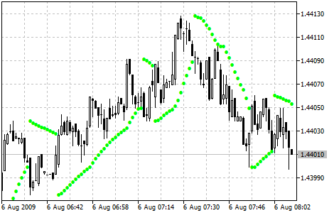

[🏠 Document Start](../../../README.md) / [Price Charts, Technical and Fundamental Analysis](../../README.md) / [Technical Indicators](../../Technical-Indicators.md) / [Trend Indicators](../Trend-Indicators.md) / Parabolic SAR

[Previous](Moving-Average.md) | [Next](Standard-Deviation.md)

# Parabolic SAR

Parabolic SAR Technical Indicator was developed for analyzing the trending markets. The indicator is constructed on the price chart. This indicator is similar to [Moving Average](Moving-Average.md) with the only difference that Parabolic SAR moves with higher acceleration and may change its position in terms of the price. The indicator is below the prices on the bull market (Up Trend), when the market is bearish (Down Trend), it is above the prices.

If the price crosses Parabolic SAR lines, the indicator turns, and its further values are situated on the other side of the price. When such an indicator turn does take place, the maximum or the minimum price for the previous period would serve as the starting point. When the indicator makes a turn, it gives a signal of the trend end (correction stage or flat), or of its turn.

The Parabolic SAR is an outstanding indicator for providing exit points. Long positions should be closed when the price sinks below the SAR line, short positions should be closed when the price rises above the SAR line. It means one should trace the movement of Parabolic SAR and hold open positions only in the direction of this movement. It is often the case that the indicator serves as a trailing stop line.

If the long position is open (i.e., the price is above the SAR line), the Parabolic SAR line will go up, regardless of what direction the prices take. The length of the SAR line movement depends on the scale of the price movement.

> You can test the [trade signals](https://www.mql5.com/en/docs/standardlibrary/ExpertClasses/CSignal/signal_sar) of this indicator by creating an Expert Advisor in [MQL5 Wizard](https://www.metatrader5.com/en/automated-trading/mql5wizard).

## Calculation

For long positions:

SAR (i) = SAR (i - 1) + ACCELERATION * (HIGH (i - 1) - SAR (i - 1))

For short positions:

SAR (i) = SAR (i - 1) + ACCELERATION * (LOW (i - 1) - SAR (i - 1)) 

Where:

SAR (i - 1) — value of Parabolic SAR on the previous bar;  
ACCELERATION — acceleration factor;  
HIGH (i - 1) — maximal price for the previous period;  
LOW (i - 1) — minimal price for the previous period.

The indicator value increases if the price of the current bar is higher than previous bullish and vice versa. The acceleration factor (ACCELERATION) will double at the same time, which would cause Parabolic SAR and the price to come together. In other words, the faster the price grows or sinks, the faster the indicator approaches the price.
