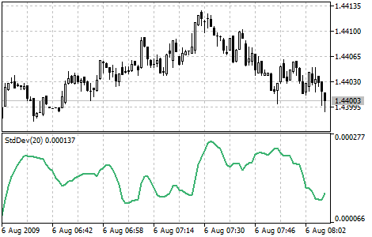

[🏠 Document Start](../../../README.md) / [Price Charts, Technical and Fundamental Analysis](../../README.md) / [Technical Indicators](../../Technical-Indicators.md) / [Trend Indicators](../Trend-Indicators.md) / Standard Deviation

[Previous](Parabolic-SAR.md) | [Next](Triple-Exponential-Moving-Average.md)

# Standard Deviation

Standard Deviation — value of the market volatility measurement. This indicator describes the range of price fluctuations relative to [Moving Average](Moving-Average.md). So, if the value of this indicator is high, the market is volatile, and prices of bars are rather spread relative to the moving average. If the indicator value is low, the market can described as having a low volatility, and prices of bars are rather close to the moving average.

Normally, this indicator is used as a constituent of other indicators. Thus, when calculating [Bollinger Bands®](Bollinger-Bands.md) one has to add the symbol standard deviation value to its [moving average](Moving-Average.md).

The market behavior represents the interchange of high trading activity and languid market. So, the indicator can be interpreted easily:

  * if its value is too low, i.e., the market is absolutely inactive, it makes sense to expect a spike soon;
  * otherwise, if it is extremely high, it most probably means that activity will decline soon.

## Calculation

StdDev (i) = SQRT (AMOUNT (j = i - N, i) / N)

AMOUNT (j = i - N, i) = SUM ((ApPRICE (j) - MA (ApPRICE , N, i)) ^ 2)

Where:

StdDev (i) — Standard Deviation of the current bar;  
SQRT — square root;  
AMOUNT(j = i - N, i) — sum of squares from j = i - N to i;  
N — smoothing period;  
ApPRICE (j) — applied price of the j bar;  
MA (ApPRICE , N, i) — moving average value with the N period on the current bar;  
ApPRICE (i) — applied price of the current bar.
