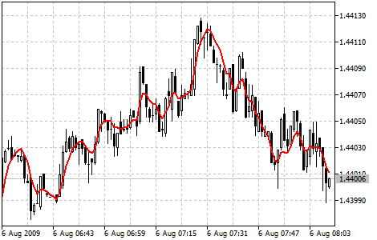

[🏠 Document Start](../../../README.md) / [Price Charts, Technical and Fundamental Analysis](../../README.md) / [Technical Indicators](../../Technical-Indicators.md) / [Trend Indicators](../Trend-Indicators.md) / Triple Exponential Moving Average

[Previous](Standard-Deviation.md) | [Next](Variable-Index-Dynamic-Average.md)

# Triple Exponential Moving Average

Triple Exponential Moving Average Technical Indicator (TEMA) was developed by Patrick Mulloy and published in the "Technical Analysis of Stocks & Commodities" magazine. The principle of its calculation is similar to [DEMA (Double Exponential Moving Average)](Double-Exponential-Moving-Average.md). The name "Triple Exponential Moving Average" does not very correctly reflect its algorithm. This is a unique blend of the single, double and triple exponential moving average providing the smaller lag than each of them separately.

TEMA can be used instead of traditional moving averages. It can be used for smoothing price data, as well as for smoothing other indicators.

> You can test the [trade signals](https://www.mql5.com/en/docs/standardlibrary/ExpertClasses/CSignal/signal_tema) of this indicator by creating an Expert Advisor in [MQL5 Wizard](https://www.metatrader5.com/en/automated-trading/mql5wizard).

## Calculation

First DEMA is calculated, then the error of price deviation from DEMA is calculated:

err(i) = Price(i) — DEMA(Price, N, ii)

Where:

err(i) — current DEMA error;  
Price(i) — current price;  
DEMA(Price, N, i) — current DEMA value from Price series with N period.

Then add value of the exponential average of the error and get TEMA:

TEMA(i) = DEMA(Price, N, i) + EMA(err, N, i) = DEMA(Price, N, i) + EMA(Price - EMA(Price, N, i), N, i) =

= DEMA(Price, N, i) + EMA(Price - DEMA(Price, N, i), N, i) = 3 * EMA(Price, N, i) - 3 * EMA2(Price, N, i) + EMA3(Price, N, i)

Where:

EMA(err, N, i) — current value of the exponential average of the err error;  
EMA2(Price, N, i) — current value of the double sequential price smoothing;  
EMA3(Price, N, i) — current value of the triple sequential price smoothing. 
