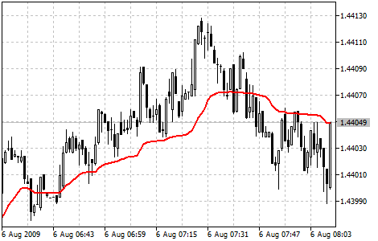

[🏠 Document Start](../../../README.md) / [Price Charts, Technical and Fundamental Analysis](../../README.md) / [Technical Indicators](../../Technical-Indicators.md) / [Trend Indicators](../Trend-Indicators.md) / Variable Index Dynamic Average

[Previous](Triple-Exponential-Moving-Average.md) | [Next](../Oscillators.md)

# Variable Index Dynamic Average

Variable Index Dynamic Average Technical Indicator (VIDYA) was developed by Tushar Chande. It is an original method of calculating the [Exponential Moving Average (EMA) (#ema)](Moving-Average.md#ema) with the dynamically changing period of averaging. Period of averaging depends on the market volatility; as the measure of volatility Chande Momentum Oscillator (CMO) was chosen. This oscillator measures the ratio between the sum of positive increments and sum of negative increments for a certain period (CMO period). CMO value is used as the ratio to the smoothing factor EMA. Thus VIDYA has to setup parameters: period of CMO and period of EMA.

## Application

Usually not VIDYA itself is used in trading systems, but its upper and lower borders (Upper band & Lower band), that are by N% above and below VIDYA. Interpretation of the indicator for receiving trade signals in this form is performed similar to [Bollinger Bands®](Bollinger-Bands.md).

## Calculation

The standard [Exponential Moving Average (#ema)](Moving-Average.md#ema) is calculated according to the below formula:

EMA(i) = Price(i) * F + EMA(i-1)*(1-F)

Where:

F = 2/(Period_EMA+1) — smoothing factor;  
Period_EMA — EMA averaging period;  
Price(i) — current price;  
EMA(i-1) — previous value of EMA.

The value of Variable Index Dynamic Average is calculated in the analogous way using CMO:

VIDYA(i) = Price(i) * F * ABS(CMO(i)) + VIDYA(i-1) * (1 - F* ABS(CMO(i)))

Where:

ABS(CMO(i)) — absolute current value Chande Momentum Oscillator;  
VIDYA(i-1) — previous value of VIDYA.

The value of CMO is calculated according to the below formula:

CMO(i) = (UpSum(i) - DnSum(i))/(UpSum(i) + DnSum(i))

Where:

UpSum(i) = current sum of positive price increments for the period;  
DnSum(i) = current sum of negative price increments for the period.
